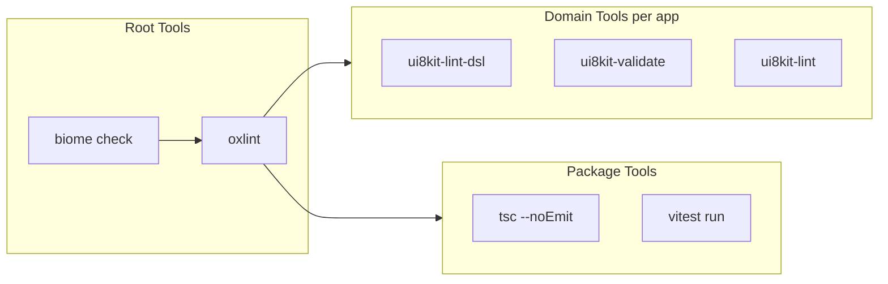
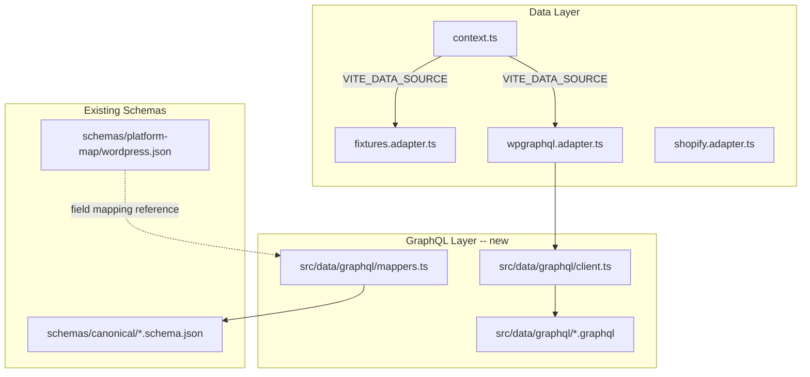

# Biome + Oxlint Root Setup for Monorepo

## Current State

- Monorepo with `apps/dsl`, `apps/dsl-crm`, `apps/dsl-design` and `packages/generator`, `packages/maintain`
- Lint pipeline: `turbo run lint` calls per-package `lint` scripts (`tsc --noEmit` in packages, `bunx ui8kit-lint` in apps)
- No code formatter configured
- No import boundary enforcement
- Packages use `vite build` for bundling (`packages/generator`); `packages/maintain` has no build step
- Dependencies between packages: `maintain` depends on `generator` (`workspace:*`), `generator` depends on `@ui8kit/sdk` (npm)
- Biome, Oxlint, Rollup are **not installed** anywhere

## Architecture Decision

- **Rollup is not needed**: Vite already uses Rollup internally; `packages/generator` builds with `vite build`
- Biome and Oxlint install **only in root** `devDependencies`
- Biome handles: formatting (JS/TS/JSON/CSS/GraphQL) + general lint rules (correctness, style, complexity)
- Oxlint handles: `no-restricted-imports` for import boundaries between packages
- Existing domain tools (ui8kit-lint, ui8kit-lint-dsl, ui8kit-validate) stay unchanged

## Pipeline After Changes




---

## Step 1: Install Biome and Oxlint in Root

In root [package.json](package.json), add to `devDependencies`:

- `@biomejs/biome` (latest)
- `oxlint` (latest)

Add root scripts:

```json
"scripts": {
  "format": "biome format --write .",
  "format:check": "biome check .",
  "lint:biome": "biome check .",
  "lint:oxlint": "oxlint --import-plugin --tsconfig tsconfig.json packages/ apps/",
  "lint:all": "bun run lint:biome && bun run lint:oxlint && turbo run lint"
}
```

---

## Step 2: Create `biome.json` in Root

Key configuration decisions:

- **Formatter**: indent with spaces (2), single quotes for JS, trailing commas
- **Linter**: enable recommended rules; disable rules that conflict with ui8kit-lint domain checks
- **Files**: include `apps/`**, `packages/`**; ignore `dist/`, `node_modules/`, `*.map.json`, `*.map.ts` (generated files)
- **Overrides**: JSON files -- format only, no lint; `.test.ts` files -- allow `console`
- **GraphQL**: enable format + lint for future `.graphql` files

```json
{
  "$schema": "https://biomejs.dev/schemas/2.0/schema.json",
  "vcs": { "enabled": true, "clientKind": "git", "useIgnoreFile": true },
  "organizeImports": { "enabled": true },
  "formatter": {
    "enabled": true,
    "indentStyle": "space",
    "indentWidth": 2,
    "lineWidth": 120
  },
  "javascript": {
    "formatter": {
      "quoteStyle": "single",
      "trailingCommas": "all"
    }
  },
  "linter": {
    "enabled": true,
    "rules": {
      "recommended": true
    }
  },
  "files": {
    "ignore": [
      "dist/",
      "node_modules/",
      ".turbo/",
      "**/ui8kit.map.json",
      "**/utility-props.map.ts",
      "**/tw-css-extended.json"
    ]
  }
}
```

---

## Step 3: Create `.oxlintrc.json` in Root

Focus: import boundaries for packages destined for separate repos / npm publish.

- Enable `import` plugin
- Configure `no-restricted-imports` to enforce boundaries:
  - `packages/generator` must NOT import from `packages/maintain` (one-way dependency)
  - `packages/*` must NOT import from `apps/*`
  - Within packages, restrict internal cross-imports to declared `exports` entry points only

```json
{
  "plugins": ["import"],
  "rules": {
    "no-restricted-imports": ["error", {
      "patterns": [
        {
          "group": ["../../apps/*"],
          "message": "Packages must not import from apps/."
        },
        {
          "group": ["../maintain/*", "@ui8kit/maintain"],
          "message": "Generator must not depend on maintain."
        }
      ]
    }]
  }
}
```

Oxlint overrides per package can be added later via nested `.oxlintrc.json` if needed.

---

## Step 4: Integrate into Turbo Pipeline

Update [turbo.json](turbo.json) to add root-level tasks:

```json
{
  "tasks": {
    "lint:biome": { "cache": true },
    "lint:oxlint": { "cache": true },
    "lint": { "dependsOn": [] }
  }
}
```

The root `lint:all` script runs Biome and Oxlint first (root-level, no per-package install), then delegates to `turbo run lint` for per-package domain checks.

---

## Step 5: Update Package `lint` Scripts

In [packages/generator/package.json](packages/generator/package.json) and [packages/maintain/package.json](packages/maintain/package.json):

- Keep `"lint": "tsc --noEmit"` (type checking)
- Optionally add `"lint:boundaries": "oxlint --import-plugin ."` (uses root-installed oxlint via hoisting)

Biome and Oxlint are NOT added to package `devDependencies`; they are available through workspace hoisting from root `node_modules`.

---

## Step 6: Pre-publish Validation Script

Add a root script for validating packages before `npm publish`:

```json
"scripts": {
  "prepublish:check": "biome check packages/ && oxlint --import-plugin packages/ && turbo run typecheck --filter='./packages/*' && turbo run test --filter='./packages/*'"
}
```

This runs sequentially:

1. Biome format + lint check on packages
2. Oxlint import boundary check on packages
3. TypeScript type check per package
4. Tests per package (generator has vitest)

---

## Step 7: CI Integration Notes

- In CI, run `bun run format:check` (Biome, non-destructive) instead of `format --write`
- Run `bun run lint:all` which covers Biome + Oxlint + domain tools
- For packages publishing: run `bun run prepublish:check` before `npm publish`

---

## Files Changed (Summary)


| File                              | Action                                                         |
| --------------------------------- | -------------------------------------------------------------- |
| `package.json` (root)             | Add `@biomejs/biome`, `oxlint` to devDependencies; add scripts |
| `biome.json` (root, new)          | Biome configuration                                            |
| `.oxlintrc.json` (root, new)      | Oxlint configuration with import boundaries                    |
| `turbo.json`                      | Add `lint:biome`, `lint:oxlint` tasks                          |
| `packages/generator/package.json` | Optionally extend `lint` script                                |
| `packages/maintain/package.json`  | Optionally extend `lint` script                                |


---

## Step 8: GraphQL Connector Layer (Future-Ready)

### Context

The adapter layer in `apps/dsl/src/data/adapters/` already supports multiple data sources via `VITE_DATA_SOURCE` env variable (`fixtures` | `wpgraphql` | `shopify`). Currently `wpgraphql.adapter.ts` and `shopify.adapter.ts` are stubs that delegate to `fixtures.adapter.ts`. The goal is to prepare the infrastructure so the WPGraphQL adapter can optionally fetch data from a real GraphQL endpoint instead of JSON fixtures.

### Architecture




### 8.1 Create GraphQL Operations Directory

Create `apps/dsl/src/data/graphql/` with:

- `menu.graphql` -- query for catalog items (mapped from `schemas/platform-map/wordpress.json` `catalog` domain)
- `promotions.graphql` -- query for promotions (mapped from `promo` domain)
- `site.graphql` -- query for site info / navigation
- `client.ts` -- lightweight GraphQL client stub (fetch-based, endpoint from `VITE_GRAPHQL_ENDPOINT` env)
- `mappers.ts` -- functions that transform WPGraphQL response shape to `CanonicalContextInput` using field mappings from `schemas/platform-map/wordpress.json`

Example `menu.graphql`:

```graphql
query GetMenuItems($first: Int = 100) {
  products(first: $first) {
    nodes {
      databaseId
      slug
      name
      description
      shortDescription
      price
      regularPrice
      image {
        sourceUrl
        altText
      }
      productCategories {
        nodes {
          slug
          name
        }
      }
    }
  }
}
```

### 8.2 Update `wpgraphql.adapter.ts`

Replace stub with conditional logic:

- If `VITE_GRAPHQL_ENDPOINT` is set: use `client.ts` to fetch, then `mappers.ts` to transform to `CanonicalContextInput`
- If not set: fallback to `loadFixturesContextInput()` (current behavior preserved)

### 8.3 Enable Biome GraphQL Lint

In `biome.json`, add overrides for `.graphql` files to enable GraphQL-specific rules:

```json
"overrides": [
  {
    "include": ["**/*.graphql"],
    "linter": {
      "rules": {
        "correctness": {
          "useGraphqlNamedOperations": "error"
        },
        "suspicious": {
          "noDuplicateFields": "error"
        },
        "style": {
          "useDeprecatedReason": "warn",
          "useGraphqlNamingConvention": "warn"
        }
      }
    }
  }
]
```

This ensures all `.graphql` files in the repo are formatted and linted by Biome automatically as part of `biome check`.

### 8.4 Add `.env.example` Variables

In `apps/dsl/.env.example`, add:

```env
VITE_DATA_SOURCE=fixtures
# VITE_GRAPHQL_ENDPOINT=https://your-wp-site.com/graphql
```

---

## Files Changed (Summary)


| File                                                 | Action                                                         |
| ---------------------------------------------------- | -------------------------------------------------------------- |
| `package.json` (root)                                | Add `@biomejs/biome`, `oxlint` to devDependencies; add scripts |
| `biome.json` (root, new)                             | Biome configuration with GraphQL overrides                     |
| `.oxlintrc.json` (root, new)                         | Oxlint configuration with import boundaries                    |
| `turbo.json`                                         | Add `lint:biome`, `lint:oxlint` tasks                          |
| `packages/generator/package.json`                    | Optionally extend `lint` script                                |
| `packages/maintain/package.json`                     | Optionally extend `lint` script                                |
| `apps/dsl/src/data/graphql/` (new dir)               | GraphQL operations, client stub, mappers                       |
| `apps/dsl/src/data/graphql/menu.graphql` (new)       | WPGraphQL query for catalog items                              |
| `apps/dsl/src/data/graphql/promotions.graphql` (new) | WPGraphQL query for promotions                                 |
| `apps/dsl/src/data/graphql/site.graphql` (new)       | WPGraphQL query for site/nav                                   |
| `apps/dsl/src/data/graphql/client.ts` (new)          | Fetch-based GraphQL client stub                                |
| `apps/dsl/src/data/graphql/mappers.ts` (new)         | Response-to-canonical mappers                                  |
| `apps/dsl/src/data/adapters/wpgraphql.adapter.ts`    | Replace stub with real adapter logic                           |
| `apps/dsl/.env.example`                              | Add `VITE_GRAPHQL_ENDPOINT` variable                           |


---

## What This Does NOT Change

- Domain tools (`ui8kit-lint`, `ui8kit-lint-dsl`, `ui8kit-validate`) remain in apps -- not replaced
- Existing `turbo run lint` pipeline continues to work
- No changes to `packages/*/dependencies` or `devDependencies` for Biome/Oxlint
- Vite build in `packages/generator` stays unchanged (no Rollup addition)
- `VITE_DATA_SOURCE=fixtures` remains the default; GraphQL connector is opt-in via env variable

