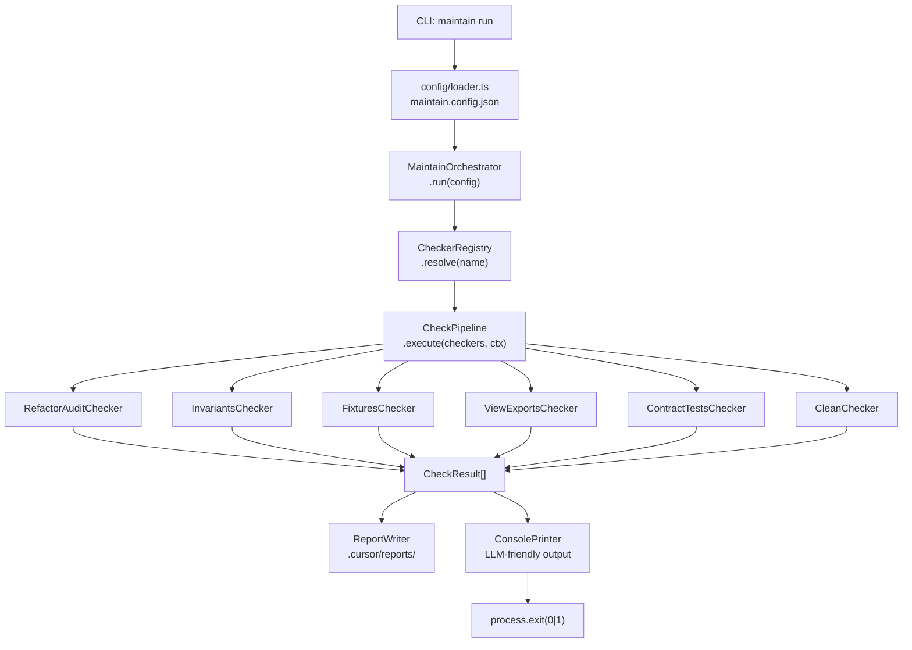

# packages/maintain — Plan

## Контекст

В репозитории уже есть `packages/generator` с выверенной OOP-архитектурой:

- `Orchestrator` — координирует plugins, services, pipeline, events
- `IService` / `BaseService` — жизненный цикл: `initialize → execute → dispose`
- `IPipelineStage` — дискретный шаг с `order`, `canExecute`, `onError`
- `ILogger` — логирование с `child(prefix)`
- `ServiceRegistry` — топологическая сортировка зависимостей

`@ui8kit/maintain` использует **те же интерфейсы и паттерны**, но вместо генерации HTML/CSS — запускает чекеры и возвращает `MaintainReport`.

---

## Структура пакета

```
packages/maintain/
├── package.json
├── tsconfig.json
├── src/
│   ├── index.ts                    # публичный API
│   ├── cli.ts                      # bin: maintain [command] [options]
│   │
│   ├── core/
│   │   ├── interfaces/
│   │   │   ├── IChecker.ts         # аналог IService — выполняет проверку
│   │   │   ├── IMaintainConfig.ts  # конфиг из maintain.config.json
│   │   │   ├── IReport.ts          # CheckResult, MaintainReport, Issue
│   │   │   └── index.ts
│   │   ├── orchestrator/
│   │   │   └── MaintainOrchestrator.ts  # run(config) → MaintainReport
│   │   ├── pipeline/
│   │   │   └── CheckPipeline.ts    # запускает checkers последовательно/параллельно
│   │   ├── registry/
│   │   │   └── CheckerRegistry.ts  # регистрация и резолв checkers по имени
│   │   ├── logger/
│   │   │   └── Logger.ts           # переиспользовать из generator (или скопировать)
│   │   └── report/
│   │       ├── ReportWriter.ts     # пишет .cursor/reports/*.json
│   │       └── ConsolePrinter.ts   # форматированный вывод для LLM-подсказок
│   │
│   ├── checkers/
│   │   ├── BaseChecker.ts          # abstract class BaseChecker implements IChecker
│   │   ├── RefactorAuditChecker.ts # из refactor-audit.ts
│   │   ├── InvariantsChecker.ts    # из validate-invariants.ts
│   │   ├── FixturesChecker.ts      # из validate-fixtures.ts
│   │   ├── ViewExportsChecker.ts   # из validate-view-exports.ts
│   │   ├── ContractTestsChecker.ts # из contract-tests.ts
│   │   ├── CleanChecker.ts         # dry-run режим для clean
│   │   └── index.ts
│   │
│   ├── commands/
│   │   ├── validate.ts             # maintain validate [--config] [--check=...]
│   │   ├── audit.ts                # maintain audit [--mapping] [--scope]
│   │   ├── clean.ts                # maintain clean [--mode=full|dist]
│   │   └── run.ts                  # maintain run (все checkers из конфига)
│   │
│   └── config/
│       ├── loader.ts               # читает maintain.config.json + валидация Zod
│       └── defaults.ts             # дефолтная конфигурация
│
├── schemas/
│   └── maintain.config.schema.json
└── bin/
    └── maintain.ts                 # точка входа CLI
```

---

## Ключевые интерфейсы

### `IChecker` (аналог `IService`)

```typescript
interface IChecker<TConfig = unknown> {
  readonly name: string;
  readonly description: string;
  readonly enabled: boolean;
  configure(config: TConfig): void;
  run(context: CheckContext): Promise<CheckResult>;
}
```

### `IMaintainConfig` — `maintain.config.json`

```typescript
interface IMaintainConfig {
  root: string;           // путь к проекту (cwd по умолчанию)
  reportsDir?: string;    // ".cursor/reports"
  checkers: {
    refactorAudit?: { mapping: string; scope: string[] };
    invariants?: { routes: string[]; fixtures: string[]; blocks: string };
    fixtures?: { targets: Array<{ file: string; schema: string }> };
    viewExports?: { pattern: string; exportShape: "interface+function" };
    contracts?: { blueprint: string };
    clean?: { paths: string[] };
  };
}
```

### `MaintainReport` — единый выходной документ

```typescript
interface MaintainReport {
  runId: string;
  generatedAt: string;
  duration: number;
  success: boolean;
  results: CheckResult[];    // по одному на чекер
  errors: Issue[];
  warnings: Issue[];
}
```

---

## Архитектура (граф потока данных)




---

## `MaintainOrchestrator` — принцип работы

Аналогично `Orchestrator` из `packages/generator`:

- `run(config)` → инициализирует чекеры → запускает `CheckPipeline` → собирает `MaintainReport`
- `use(checker)` — fluent API для ручной регистрации
- `continueOnError: true` — не останавливается при ошибке одного чекера (аналог generator)

---

## Горизонтальное / вертикальное масштабирование

- **Горизонтальное**: добавить новый чекер = создать класс `extends BaseChecker`, добавить секцию в `maintain.config.json`
- **Вертикальное**: `CheckPipeline` поддерживает `maxParallel` — независимые чекеры запускаются параллельно
- Конфиг описывает **только то, что нужно** — ненастроенные секции = чекер отключён

---

## CLI-подсказки для LLM

`ConsolePrinter` форматирует вывод специально для LLM:

```
[FAIL] refactor-audit: 3 residual error-level matches found
  → .cursor/reports/refactor-audit-1234.json
  Hint: Run `bun run audit:refactor` to see exact lines. Replace all `from` entries with severity:error.

[OK] invariants: all 6 checks passed (routes, fixtures, blocks, context)

[FAIL] fixtures: menu.json validation failed
  L24: /items/0/price: must be number
  → Fix fixture data and re-run: maintain validate --check=fixtures
```

---

## `package.json` пакета

- `name`: `@ui8kit/maintain`
- `bin`: `{ "maintain": "./src/cli.ts" }`
- Зависимости: `zod`, `ajv`, `ajv-formats`, `typescript`, `commander`, `chalk`
- `devDependencies`: `@types/bun`, `@types/node`
- Никаких зависимостей от `@ui8kit/generator` — пакет полностью автономен

---

## Интеграция в монорепо

- Добавить `"@ui8kit/maintain": "workspace:*"` в `package.json` монорепо (devDependencies)
- Добавить `maintain:check` в `apps/dsl/package.json`: `maintain run --config maintain.config.json`
- `turbo.json`: новая задача `maintain` (без cache, без dependsOn)
- `maintain.config.json` — создать в `apps/dsl/` как конфиг-образец для проекта resta-dsl

