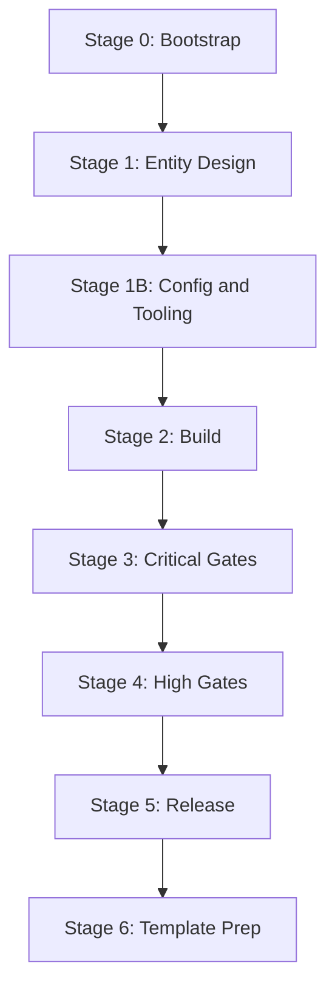

# Playbook + Template Infrastructure Refactoring

## Scenario

User forks the repo, keeps one app (e.g. `apps/dsl-crm`), opens chat, says: *"Refactor CRM entities to Leads, Deals, Clients, Companies"* or *"Refactor this into a blog with Posts, Categories, Authors"*. The LLM agent reads PLAYBOOK.md and must be able to execute every stage without hitting undocumented failures.

Current PLAYBOOK is missing a config design stage, finalize-dist.ts has hardcoded paths, and new apps are missing scripts. These are the exact failures logged in JOURNAL.md.

---

## Fix 1 — Dynamic `outDir` in `finalize-dist.ts`

Both `[apps/dsl/scripts/finalize-dist.ts](apps/dsl/scripts/finalize-dist.ts)` (line 44) and `[apps/dsl-crm/scripts/finalize-dist.ts](apps/dsl-crm/scripts/finalize-dist.ts)` (line 44) hardcode the output path:

```typescript
// apps/dsl:       const DIST_REACT = join(ROOT, "..", "react");
// apps/dsl-crm:   const DIST_REACT = join(ROOT, "..", "react-crm");
```

**Change both to read from `ui8kit.config.json`:**

```typescript
const _ui8kitCfg = JSON.parse(readFileSync(join(ROOT, "ui8kit.config.json"), "utf-8"));
const DIST_REACT = join(ROOT, _ui8kitCfg.outDir ?? "../react");
```

This way the generator and finalize always agree on the output directory.

---

## Fix 2 — Keep `@ui8kit/dsl` and `@ui8kit/sdk` in generated app when needed

In both `finalize-dist.ts` files, line ~396, dependencies are filtered:

```typescript
!['@ui8kit/dsl', '@ui8kit/generator', '@ui8kit/lint', '@ui8kit/sdk', '@ui8kit/contracts'].includes(pkg)
```

This strips `@ui8kit/dsl` and `@ui8kit/sdk` even when some files (Sheet.tsx, Icon.tsx) still import them after transformation fallback.

**Change:** After step 4 (copy app shell) and before writing `package.json`, scan the generated `src/` for remaining imports:

```typescript
function hasImportInDir(dir: string, pkg: string): boolean {
  if (!existsSync(dir)) return false;
  for (const entry of readdirSync(dir, { withFileTypes: true })) {
    const full = join(dir, entry.name);
    if (entry.isDirectory()) { if (hasImportInDir(full, pkg)) return true; }
    else if (/\.[tj]sx?$/.test(entry.name)) {
      const content = readFileSync(full, "utf-8");
      if (content.includes(`from '${pkg}'`) || content.includes(`from "${pkg}"`)) return true;
    }
  }
  return false;
}

const alwaysExclude = ['@ui8kit/generator', '@ui8kit/lint', '@ui8kit/contracts'];
const conditionalExclude = ['@ui8kit/dsl', '@ui8kit/sdk'].filter(
  pkg => !hasImportInDir(join(DIST_REACT, 'src'), pkg)
);
const excludeDeps = [...alwaysExclude, ...conditionalExclude];
```

---

## Fix 3 — Complete script set in `apps/dsl-crm/package.json`

Missing scripts (compared to `[apps/dsl/package.json](apps/dsl/package.json)`):


| Script            | Command to add                                 |
| ----------------- | ---------------------------------------------- |
| `scaffold:entity` | `bunx ui8kit-generate scaffold entity --cwd .` |
| `inspect`         | `bunx ui8kit-inspect`                          |
| `typecheck:react` | `cd ../react-crm && bun run typecheck`         |


Also: `typecheck:react` must use `outDir` basename. Since `ui8kit.config.json` has `"outDir": "../react-crm"`, the script is `cd ../react-crm && bun run typecheck`.

**Add all three** to `[apps/dsl-crm/package.json](apps/dsl-crm/package.json)` scripts section.

---

## Fix 4 — Rewrite PLAYBOOK.md for refactoring scenario

The PLAYBOOK must work for two flows:

- **A) Create from scratch:** fork template, create new app
- **B) Refactor existing app:** rename entities, rewrite fixtures/types/blocks/routes

Key changes to `[.project/PLAYBOOK.md](.project/PLAYBOOK.md)`:

### 4a. Add refactoring intro block

After the "How to Use This as a GitHub Template" section, add:

```markdown
## How to Refactor an Existing App to New Entities

If you already have an app (e.g. `apps/dsl-crm`) and want to change its domain
(e.g. from Dashboard/Tasks/Kanban/Reports to Leads/Deals/Clients/Companies):

1. Start at **Stage 1** — redefine your entity map.
2. For every old entity, replace: fixture JSON, TS type, adapter key, context domain key,
   PageView block, route, and App.tsx registration.
3. Update the three configs: `maintain.config.json` (routes, fixture targets),
   `blueprint.json` (routes, fixtures), `ui8kit.config.json` (outDir, skipRoutes).
4. Run **Stage 3-5** gates in order.
5. Log every change in `.project/JOURNAL.md`.

The locked layer (components, variants, lib, css) does NOT change during refactoring.
```

### 4b. Insert "Stage 1B — Config & Tooling Setup" between Stage 1 and Stage 2

New stage with checklist:


| Step | Action                                                                                   | Done? |
| ---- | ---------------------------------------------------------------------------------------- | ----- |
| 1B.1 | `ui8kit.config.json` — `brand` set to app name; `outDir` points to `../react-{APP_NAME}` | [ ]   |
| 1B.2 | `maintain.config.json` — `invariants.routes.required` lists all your routes              | [ ]   |
| 1B.3 | `maintain.config.json` — `invariants.fixtures.requiredPageDomains` matches your domains  | [ ]   |
| 1B.4 | `maintain.config.json` — `fixtures.targets` lists shared fixture schemas                 | [ ]   |
| 1B.5 | `maintain.config.json` — `contracts.blueprint` set to `blueprint.json`                   | [ ]   |
| 1B.6 | `blueprint.json` seed — all routes and fixtures listed                                   | [ ]   |
| 1B.7 | `bun run build:map` — generates `ui8kit.map.json`                                        | [ ]   |
| 1B.8 | `scripts/finalize-dist.ts` present and `outDir` matches `ui8kit.config.json`             | [ ]   |
| 1B.9 | All canonical scripts present in `package.json` (see table below)                        | [ ]   |


### 4c. Add canonical script table to Stage 1B

Full table of 22 required scripts — the agent verifies all exist:

```markdown
| Script | Command |
|---|---|
| dev | vite |
| build | vite build |
| generate | ...react --cwd . |
| finalize | scripts/finalize-dist.ts |
| dist:app | full gate chain |
| clean | maintain clean --mode full --execute |
| clean:dist | maintain clean --mode dist --execute |
| validate | bunx ui8kit-validate |
| maintain | alias for maintain:check |
| maintain:check | maintain run --config maintain.config.json |
| maintain:validate | maintain validate --config maintain.config.json |
| maintain:props | maintain run --check utility-props-whitelist --verbose |
| blueprint:scan | bunx ui8kit-generate blueprint:scan --cwd . |
| blueprint:validate | bunx ui8kit-generate blueprint:validate --cwd . |
| blueprint:graph | bunx ui8kit-generate blueprint:graph --cwd . |
| scaffold:entity | bunx ui8kit-generate scaffold entity --cwd . |
| inspect | bunx ui8kit-inspect |
| lint:dsl | bunx ui8kit-lint-dsl "$PWD/src" |
| lint | bunx ui8kit-lint |
| typecheck | bunx tsc --noEmit |
| typecheck:react | cd ../react-{APP_NAME} && bun run typecheck |
| build:map | ...uikit-map --cwd . |
```

### 4d. Expand Quick Rescue Paths with JOURNAL learnings

Add these rows:


| Problem                                              | Immediate action                                                                                                                           |
| ---------------------------------------------------- | ------------------------------------------------------------------------------------------------------------------------------------------ |
| `maintain:validate` fails on missing checkers        | Add `fixtures` targets and `contracts` block to `maintain.config.json`                                                                     |
| `blueprint:validate` ORPHAN_FIXTURE                  | Add the fixture to `blueprint.json` fixtures array with correct domain                                                                     |
| Script not found when running gate                   | Check canonical script table in Stage 1B; add missing script to `package.json`                                                             |
| `finalize` wrong output path                         | Verify `outDir` in `ui8kit.config.json`; finalize reads it automatically                                                                   |
| Generated app missing `@ui8kit/dsl` or `@ui8kit/sdk` | Some shell components still import DSL; finalize now auto-detects and keeps needed deps                                                    |
| Generated app missing constants/types                | Move variant mapping constants (e.g. `PRIORITY_VARIANT`) out of PageView into `src/types/` or `src/constants/` so generator preserves them |


### 4e. Update pipeline flowchart

Add Stage 1B:




