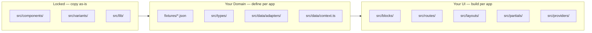

# Universal Playbook + dsl-crm Implementation

## Core Insight: Invariant vs. Variable Layers




This separation is the central idea of the new PLAYBOOK.

---

## Track 1 — PLAYBOOK.md Rewrite

**File:** `[.project/PLAYBOOK.md](.project/PLAYBOOK.md)`

Replace CRM-specific content with universal structure:

- **Title:** "App Playbook — Universal Template Guide"
- **Section 0:** What stays locked (components/variants/lib) vs. what you define (fixtures/types/blocks/routes) — table + diagram
- **Section 1:** Quick Start Journey (Mermaid `journey`) — generic (Fork → Install → Run refs → Design entities → Build → Gates → Release)
- **Section 2:** Entity Design Guide — how to define your domain (fixtures schema → TS types → adapter → context → blocks → routes), using CRM as worked example (`apps/dsl-crm`)
- **Section 3:** Quality Gates — same commands, all apps (`lint:dsl`, `validate`, `maintain:validate`, `maintain:check`, `blueprint:scan/validate`, `generate`, `finalize`)
- **Section 4:** JOURNAL.md format — entry template, what to log, when to log
- **Section 5:** Coverage Matrix (universal)
- **Section 6:** No-Skip Checklist (app-name placeholder)
- **Section 7:** Quick Rescue Paths

---

## Track 2 — JOURNAL.md Format

**File:** `[.project/JOURNAL.md](.project/JOURNAL.md)`

Entry template (agent appends per stage):

```md
## YYYY-MM-DD — <Stage>: <Title>
**What happened:** ...
**Obstacle / Error:** ...
**Resolution:** ...
**Gap / LLM pause:** ...
```

---

## Track 3 — apps/dsl-crm Implementation

### CRM Domain (entities chosen by user)

- **Dashboard** — metrics overview (Total Leads, Open Deals, Tasks Due, Conversion Rate)
- **Tasks** — list with status/priority/assignee
- **Kanban** — 3-column board (New / In Progress / Done), static 3-column `Grid`
- **Reports** — summary sections with aggregated data
- **Admin** — Login + Admin panel (same pattern as `apps/dsl`, hardcoded `admin/admin`)

### Routes

- `/` → Dashboard (CRM overview)
- `/tasks` → Tasks list
- `/kanban` → Kanban board
- `/reports` → Reports
- `/admin` → Login
- `/admin/dashboard` → Admin panel

### Files to create (in order)

**Stage A — Bootstrap (package config, tooling):**

- `apps/dsl-crm/package.json` — scripts mirror `apps/dsl`, name `@ui8kit/resta-dsl-crm`
- `apps/dsl-crm/vite.config.ts`, `tsconfig.json`, `tailwind.config.ts`, `postcss.config.js`, `index.html`
- `apps/dsl-crm/.env.example` — `VITE_DATA_SOURCE=fixtures`

**Stage B — Copy locked layer (components/variants/lib):**

- Copy `src/components/`, `src/variants/`, `src/lib/` from `apps/dsl` (identical — do NOT modify)

**Stage C — Design domain (fixtures + types + adapter + context):**

- `fixtures/shared/site.json`, `navigation.json`, `page.json`
- `fixtures/dashboard.json`, `tasks.json`, `kanban.json`, `reports.json`, `admin.json`
- `src/types/` — `common.ts`, `tasks.ts`, `kanban.ts`, `reports.ts`, `navigation.ts`, `layout.ts`, `index.ts`
- `src/data/adapters/types.ts` — `CanonicalContextInput` for CRM domain
- `src/data/adapters/fixtures.adapter.ts`
- `src/data/context.ts` — domains: `crm` (dashboard/tasks/kanban/reports) + `admin`

**Stage D — Build UI layer:**

- `src/providers/AdminAuthContext.tsx` (hardcoded admin/admin), `theme.tsx`
- `src/layouts/MainLayout.tsx`, `AdminLayout.tsx`, `index.ts`
- `src/partials/Header.tsx`, `Footer.tsx`, `Sidebar.tsx`, `SidebarContent.tsx`, `DashSidebar.tsx`, `index.ts`
- `src/blocks/` per entity:
  - `landing/DashboardPageView.tsx` (CRM home)
  - `tasks/TasksPageView.tsx`
  - `kanban/KanbanPageView.tsx`
  - `reports/ReportsPageView.tsx`
  - `admin/LoginPageView.tsx`, `DashboardPageView.tsx`
  - `HeroBlock.tsx`, `index.ts`
- `src/routes/` per entity + `src/App.tsx`, `src/main.tsx`
- `src/css/` (copied from apps/dsl)

**Stage E — Quality gates:**

- `maintain.config.json` — adapted routes/fixtures for CRM
- `blueprint.json` (seeded, then `blueprint:scan` to update)
- Run gate chain: `lint:dsl` → `validate` → `maintain:validate` → `maintain:check` → `blueprint:scan/validate` → `typecheck`

**Stage F — Generate React output:**

- `scripts/finalize-dist.ts` (copied from apps/dsl)
- `bun run generate && bun run finalize`

---

## What gets logged in JOURNAL.md (automatically)

- Each stage start/end
- Any lint/validate/maintain error + fix
- Any LLM knowledge gap (e.g. "unsure how blueprint:scan seeds blueprint.json")
- Any structural decision (e.g. "chose 3-column Grid for Kanban over custom layout")
- Gate pass confirmations

---

## Key reference files

- `[apps/dsl/package.json](apps/dsl/package.json)` — script patterns to replicate
- `[apps/dsl/maintain.config.json](apps/dsl/maintain.config.json)` — config structure to adapt
- `[apps/dsl/src/data/adapters/types.ts](apps/dsl/src/data/adapters/types.ts)` — canonical type pattern
- `[apps/dsl/src/data/context.ts](apps/dsl/src/data/context.ts)` — domain split pattern
- `[apps/dsl/src/providers/AdminAuthContext.tsx](apps/dsl/src/providers/AdminAuthContext.tsx)` — auth pattern

