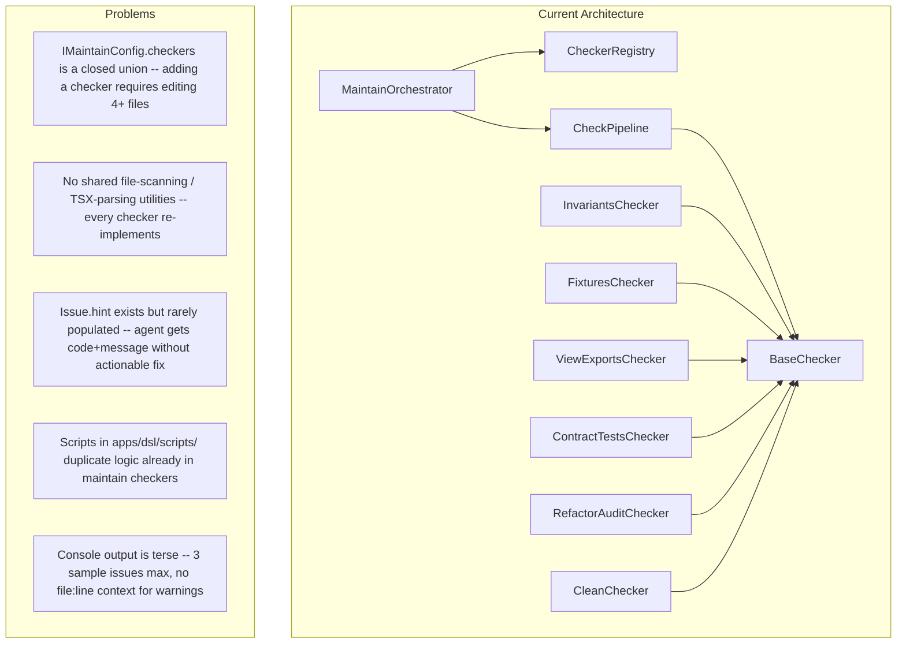
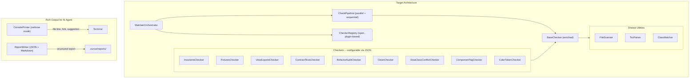

# Validation Infrastructure Refactoring

## Current State




## Target Architecture




## Phase 1: Refactoring Infrastructure (foundation)

### 1.1 Open `IMaintainConfig.checkers` for extensibility

**Problem:** `checkers` is a closed type with fixed keys (`refactorAudit`, `invariants`, ...). Adding a new checker means editing `IMaintainConfig.ts`, `maintain.config.schema.json`, `shared.ts`, and `defaults.ts`.

**Solution:** Make `checkers` an open record with typed checker configs resolved at runtime.

- [IMaintainConfig.ts](packages/maintain/src/core/interfaces/IMaintainConfig.ts): Change `checkers` to `Record<string, unknown>` with a branded lookup method in `BaseChecker`. Keep known config types as optional intersected fields for backward compatibility.
- [maintain.config.schema.json](packages/maintain/schemas/maintain.config.schema.json): Set `"additionalProperties": true` on `checkers` (or use `patternProperties`).
- `BaseChecker.configKey` becomes `string` instead of `keyof IMaintainConfig['checkers']`.

### 1.2 Enrich `Issue` with actionable hints

**Problem:** `Issue.hint` is rarely set; `details` is untyped. The AI agent reads terminal output and gets "error: X" without knowing how to fix it.

**Solution:** Extend [IReport.ts](packages/maintain/src/core/interfaces/IReport.ts):

```typescript
export interface Issue {
  level: IssueLevel;
  code: string;
  message: string;
  checker?: string;
  file?: string;
  line?: number;
  column?: number;           // new
  hint?: string;
  suggestion?: string;       // new: actionable fix ("Change component='div' to component='section'")
  expected?: string;         // new: what was expected
  received?: string;         // new: what was found
  details?: unknown;
  docs?: string;             // new: link to rule docs or architecture guide
}
```

Every checker must populate `hint` and `suggestion` where feasible. This is the key enabler for AI agent automation.

### 1.3 Shared utilities: `FileScanner` and `TsxParser`

**Problem:** InvariantsChecker, ViewExportsChecker, ContractTestsChecker, lint-gen.ts all re-implement file scanning and TSX parsing with different patterns.

**Solution:** Extract into [packages/maintain/src/utils/](packages/maintain/src/utils/):

- `**FileScanner`** -- glob-based file discovery with caching:
  - `scan(root, pattern, options?)` returns `ScannedFile[]` with path, content (lazy), stats.
  - Used by every checker that reads files.
- `**TsxParser`** -- lightweight TSX/TS analysis utilities:
  - `parseExports(content)` -- extracts exported symbols (reuse ViewExportsChecker logic).
  - `parseJsxProps(content, componentName)` -- extracts props from JSX usage (e.g. `<Block component="section" data-class="hero">`).
  - `parseImports(content)` -- extracts imports.
  - Uses TypeScript compiler API (`ts.createSourceFile`) -- already a dependency.
- `**ClassMatcher**` -- Tailwind class analysis:
  - `extractColorClasses(classes)` -- filters `bg-*`, `text-*`, `border-*`.
  - `isTokenColor(className, whitelist)` -- checks against token whitelist.
  - `detectConflicts(classSets)` -- finds contradicting utilities (e.g. `gap-4` + `gap-6`).

### 1.4 Refactor ConsolePrinter for verbose, AI-friendly output

**Problem:** [ConsolePrinter.ts](packages/maintain/src/core/report/ConsolePrinter.ts) shows max 3 sample issues per checker, no `hint`/`suggestion`, no `file:line` for warnings.

**Solution:**

- Default mode (human): same as now but include `hint` after each issue.
- `--verbose` mode: show ALL issues with `file:line:column`, `hint`, `suggestion`, and `expected`/`received` when present.
- Format each issue as a single parseable line:

```
[ERROR] ROUTE_MISSING  src/App.tsx:1  Required route "/menu" not found
  hint: Add <Route path="/menu" element={...} /> to App.tsx
```

This format is what the AI agent reads from terminal output. The agent can grep for `[ERROR]` / `[WARN]` and read the hint to auto-fix.

### 1.5 Auto-registration of checkers (DRY)

**Problem:** [shared.ts](packages/maintain/src/commands/shared.ts) manually instantiates and `.use()`-s every checker. Adding a checker = editing this file.

**Solution:** Auto-discover checkers or use a declarative registry:

```typescript
// shared.ts
const BUILTIN_CHECKERS: IChecker[] = [
  new RefactorAuditChecker(),
  new InvariantsChecker(),
  new FixturesChecker(),
  new ViewExportsChecker(),
  new ContractTestsChecker(),
  new CleanChecker(),
  // new checkers just add a line here -- or auto-discover from checkers/ directory
];

for (const checker of BUILTIN_CHECKERS) {
  orchestrator.use(checker);
}
```

Combined with open config (1.1), a new checker only needs: (a) a class file, (b) a config entry in `maintain.config.json`.

---

## Phase 2: New Checkers (BACKLOG-001 / BACKLOG-002)

Built on Phase 1 infrastructure. Each checker follows `BaseChecker` pattern, uses shared utilities, populates `hint`/`suggestion`.

### 2.1 DataClassConflictChecker (BACKLOG-001 D)

- **Config key:** `dataClassConflicts`
- **Config:**

```json
  {
    "scope": ["src"],
    "pattern": "**/*.tsx",
    "ignoreDataClasses": ["wrapper"]
  }
  

```

- **Logic:**
  1. `FileScanner.scan(root, pattern)` -- find TSX files.
  2. `TsxParser.parseJsxProps(content, '*')` -- extract `data-class` + utility props from all component usages.
  3. For each `data-class`, compute a canonical class set key (sorted resolved Tailwind classes).
  4. If same `data-class` has > 1 distinct class set key -- emit issue with `code: 'DATA_CLASS_CONFLICT'`, `suggestion: "Use unique data-class names or unify props"`, `details: { classSets }`.
- **File:** `packages/maintain/src/checkers/DataClassConflictChecker.ts`

### 2.2 ComponentTagChecker (BACKLOG-002)

- **Config key:** `componentTag`
- **Config:**

```json
  {
    "scope": ["src"],
    "pattern": "**/*.tsx",
    "tagMapPath": null
  }
  

```

- **Logic:**
  1. Load `component-tag-map.json` via `loadComponentTagMap()` from `@ui8kit/generator/lib`.
  2. `FileScanner.scan` + `TsxParser.parseJsxProps` -- extract `component` prop from Block, Box, Stack, Group, Text, Icon, Field.
  3. `validateComponentTag(componentName, tagValue)` -- check against allowed tags.
  4. Emit issue with `suggestion: "Change component='${tag}' to one of: ${allowed.join(', ')}"`.
- **File:** `packages/maintain/src/checkers/ComponentTagChecker.ts`

### 2.3 ColorTokenChecker (BACKLOG-001 extension)

- **Config key:** `colorTokens`
- **Config:**

```json
  {
    "scope": ["src"],
    "pattern": "**/*.tsx",
    "tokenSource": "utility-props.map",
    "utilityPropsMapPath": "./src/lib/utility-props.map.ts"
  }
  

```

- **Logic:**
  1. Parse `utility-props.map.ts` to get allowed color token values (keys: `bg`, `textColor`, `border`, `ring`, `accent`, etc.).
  2. Scan TSX for usage of these props with non-whitelisted values.
  3. Emit issue with `expected: "primary | secondary | muted | ..."`, `received: "red-500"`, `suggestion: "Use a semantic token"`.
- **File:** `packages/maintain/src/checkers/ColorTokenChecker.ts`

---

## Phase 3: Consolidate app scripts into maintain

### 3.1 Migrate `apps/dsl/scripts/validate-*.ts` and `lint-gen.ts`

**Problem:** `validate-fixtures.ts`, `validate-invariants.ts`, `validate-view-exports.ts` in `apps/dsl/scripts/` duplicate logic that already exists in maintain checkers (FixturesChecker, InvariantsChecker, ViewExportsChecker).

**Solution:**

- Keep scripts as thin wrappers that call `maintain validate --check <name>`.
- Or remove scripts entirely and update `package.json` to use `maintain validate` directly.
- `lint-gen.ts` (GEN001-GEN008 rules) becomes a new `**GenLintChecker`** in maintain, reusing `TsxParser`.

### 3.2 GenLintChecker

- **Config key:** `genLint`
- **Config:**

```json
  {
    "scope": ["src/blocks", "src/layouts", "src/partials"],
    "pattern": "**/*.tsx",
    "rules": {
      "GEN001": "error",
      "GEN002": "error",
      "GEN003": "warn",
      "GEN004": "error",
      "GEN005": "warn",
      "GEN006": "error",
      "GEN007": "error",
      "GEN008": "warn"
    }
  }
  

```

- Each rule has a `suggestion` (e.g. GEN001: "Extract function outside component or move to utils").
- Configurable severity per rule.

---

## Phase 4: HtmlConverterService warnings (generator package)

### 4.1 Add `warnings` to `HtmlConverterOutput`

- [HtmlConverterService.ts](packages/generator/src/services/html-converter/HtmlConverterService.ts): Add `warnings: Array<{ code: string; message: string; file?: string; hint?: string }>` to output.
- Populate from existing `logger.warn` calls (component-tag validation) and new data-class conflict detection in `groupBySelectors`.
- Wire into generator CLI output ([generate.ts](packages/generator/src/cli/generate.ts)) so warnings appear alongside build warnings.

---

## Rich Terminal Output Format (for AI agent)

All checkers produce output following this format:

```
maintain validate

  [invariants]  Validate route, fixture, block, and context invariants
  ✓ PASS  (4 checks, 0 errors, 1 warning, 12ms)
    [WARN] BLOCK_NOT_EXPORTED  src/blocks/index.ts:1
      Block "PromoGrid" is not exported from src/blocks/index.ts.
      hint: Add `export { PromoGrid } from './PromoGrid';` to src/blocks/index.ts

  [componentTag]  Validate component prop against allowed HTML tags
  ✗ FAIL  (18 checks, 2 errors, 0 warnings, 8ms)
    [ERROR] COMPONENT_TAG_INVALID  src/blocks/HeroBlock.tsx:12
      Block does not allow tag "div". Allowed: section, article, aside, header, footer, nav, main
      hint: Change component="div" to component="section"
    [ERROR] COMPONENT_TAG_INVALID  src/blocks/FeaturedBlock.tsx:8
      Block does not allow tag "span". Allowed: section, article, aside, header, footer, nav, main
      hint: Change component="span" to component="section"

  Summary: 2 errors, 1 warning  (FAIL)
  Report: .cursor/reports/maintain-abc123.json
```

The AI agent reads this terminal output, sees `[ERROR]` lines with `file:line` and `hint`, and knows exactly what to fix and where.

---

## Files to modify (Phase 1)

- [packages/maintain/src/core/interfaces/IMaintainConfig.ts](packages/maintain/src/core/interfaces/IMaintainConfig.ts) -- open checkers type
- [packages/maintain/src/core/interfaces/IChecker.ts](packages/maintain/src/core/interfaces/IChecker.ts) -- configKey becomes string
- [packages/maintain/src/core/interfaces/IReport.ts](packages/maintain/src/core/interfaces/IReport.ts) -- enrich Issue
- [packages/maintain/src/checkers/BaseChecker.ts](packages/maintain/src/checkers/BaseChecker.ts) -- update configKey type, add helper methods for enriched issues
- [packages/maintain/src/core/report/ConsolePrinter.ts](packages/maintain/src/core/report/ConsolePrinter.ts) -- verbose mode, hints, full issue display
- [packages/maintain/src/commands/shared.ts](packages/maintain/src/commands/shared.ts) -- auto-registration pattern
- [packages/maintain/schemas/maintain.config.schema.json](packages/maintain/schemas/maintain.config.schema.json) -- open additionalProperties
- [packages/maintain/src/utils/FileScanner.ts](packages/maintain/src/utils/FileScanner.ts) -- new
- [packages/maintain/src/utils/TsxParser.ts](packages/maintain/src/utils/TsxParser.ts) -- new
- [packages/maintain/src/utils/ClassMatcher.ts](packages/maintain/src/utils/ClassMatcher.ts) -- new

## Files to create (Phase 2)

- `packages/maintain/src/checkers/DataClassConflictChecker.ts`
- `packages/maintain/src/checkers/ComponentTagChecker.ts`
- `packages/maintain/src/checkers/ColorTokenChecker.ts`

## Files to create (Phase 3)

- `packages/maintain/src/checkers/GenLintChecker.ts`

