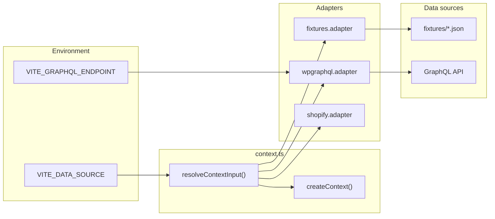

# Data, GraphQL & Validation 101 — Setup, Explanation, and Configs

A beginner-friendly guide to how app data is loaded, how the GraphQL connector works, and how to configure linters and data validation in this project.

Use together with: [PLAYBOOK.md](PLAYBOOK.md), [CLI_COMMANDS.md](../CLI_COMMANDS.md), [Biome-Oxlint-101.md](Biome-Oxlint-101.md).

---

## 1. What Was Done (Commit 387b8058)

Commit `387b80582a66648b241a0078b812e39f2a46c558` scaffolded the WPGraphQL connector layer so the app can optionally load data from a GraphQL endpoint instead of JSON fixtures.

| Change | Purpose |
|--------|--------|
| **`apps/dsl/src/data/graphql/`** | New directory: `.graphql` query files, `client.ts` (fetch-based GraphQL client), `mappers.ts` (WPGraphQL response → canonical shape), `codegen.yml` (GraphQL Code Generator config stub). |
| **`wpgraphql.adapter.ts`** | Replaced stub with real adapter: if `VITE_GRAPHQL_ENDPOINT` is set, fetches menu, promotions, and site via GraphQL and maps to `CanonicalContextInput`; otherwise falls back to fixtures. Now async. |
| **`context.ts`** | `resolveContextInput()` is async; when source is `wpgraphql`, awaits `loadWpGraphqlContextInput()`. Top-level `input` is set via `await resolveContextInput()`. |
| **`.env.example`** | Added `VITE_DATA_SOURCE=fixtures` and commented `VITE_GRAPHQL_ENDPOINT` so developers know how to switch to GraphQL. |

---

## 2. Data Layer Overview

### 2.1 Flow



- **`VITE_DATA_SOURCE`**: `fixtures` | `wpgraphql` | `shopify`. Chooses which adapter runs.
- **Adapters** return the same shape: `CanonicalContextInput` (see `src/data/adapters/types.ts`). So blocks and routes do not care whether data came from JSON or GraphQL.
- **context.ts** calls one adapter, then passes the result to `createContext()` and exports frozen `context` and `domains`.

### 2.2 Canonical Shape

All adapters must return `CanonicalContextInput`:

- `site`, `page`, `navigation` (shared)
- `fixtures`: `landing`, `menu`, `recipes`, `blog`, `promotions`, `admin`

TypeScript types live in `src/data/adapters/types.ts`. Fixture JSON files and GraphQL mappers both produce data that matches these types.

---

## 3. Fixtures (JSON)

- **Location**: `apps/dsl/fixtures/` — `landing.json`, `menu.json`, `recipes.json`, `blog.json`, `promotions.json`, `admin.json`, plus `shared/site.json`, `shared/navigation.json`, `shared/page.json`.
- **Adapter**: `src/data/adapters/fixtures.adapter.ts` imports these JSON files and returns a single object that satisfies `CanonicalContextInput`.
- **Validation**: Fixtures are validated against JSON schemas listed in `maintain.config.json` under `checkers.fixtures.targets` (see section 6).

---

## 4. GraphQL Connector

### 4.1 When It Runs

- **Condition**: `VITE_DATA_SOURCE=wpgraphql` **and** `VITE_GRAPHQL_ENDPOINT` is set (e.g. `https://your-wp-site.com/graphql`).
- **If endpoint is missing**: WPGraphQL adapter returns fixture-backed data (same as fixtures adapter).
- **On request error**: Adapter catches and falls back to fixtures.

### 4.2 Files and Roles

| File | Role |
|------|------|
| `src/data/graphql/client.ts` | `requestGraphql<T>(options)` — POST to endpoint, send `query` + `operationName` + `variables`, return `data` or throw on HTTP/GraphQL errors. |
| `src/data/graphql/menu.graphql` | Query `GetMenuItems` — products with fields aligned to canonical menu item shape (and to `schemas/platform-map/wordpress.json` catalog mapping). |
| `src/data/graphql/promotions.graphql` | Query `GetPromotions` — promotions with meta and featured image. |
| `src/data/graphql/site.graphql` | Query `GetSiteMetadata` — generalSettings (title, description) and menuItems for nav. |
| `src/data/graphql/mappers.ts` | `mapWpGraphqlToCanonicalContextInput({ fallback, menuData, promotionsData, siteData })` — maps WPGraphQL response types to `CanonicalContextInput`; uses `fallback` for missing or empty data and for domains not fetched (e.g. landing, recipes, blog, admin). |

### 4.3 Example: Adding a New GraphQL Query

1. **Add a query file** in `src/data/graphql/`, e.g. `recipes.graphql`:

   ```graphql
   query GetRecipes($first: Int = 100) {
     recipes(first: $first) {
       nodes {
         databaseId
         slug
         title
         excerpt
         # ... fields matching canonical GuideItem / recipes fixture
       }
     }
   }
   ```

2. **Keep operations named** (Biome rule `useGraphqlNamedOperations`): use `query GetRecipes`, not `query { ... }`.

3. **In `mappers.ts`**: Define a type for the response (e.g. `WpGraphqlRecipesQueryData`), add a mapper function to canonical `RecipesFixture`, and call it from `mapWpGraphqlToCanonicalContextInput`.

4. **In `wpgraphql.adapter.ts`**: Import the new query (e.g. `import recipesQuery from '../graphql/recipes.graphql?raw'`), add `requestGraphql<WpGraphqlRecipesQueryData>({ endpoint, query: recipesQuery, operationName: 'GetRecipes', variables: { first: 100 } })` to the `Promise.all`, and pass the result into the mapper.

5. **Run Biome** so `.graphql` files are formatted and linted: `bun run lint:biome` (from root).

### 4.4 Platform Map (Field Mapping Reference)

`schemas/platform-map/wordpress.json` describes how **canonical** field paths map to **WPGraphQL** field paths (e.g. `title` → `name`, `price.display` → `price`). The GraphQL queries and mappers follow this mapping so that the canonical shape stays consistent whether data comes from fixtures or WordPress.

- **Canonical schemas**: `schemas/canonical/*.schema.json` — define the target shape for validation.
- **Platform map**: Used as reference when writing queries and mappers; not executed at runtime.

---

## 5. Linter and Validation Configs

### 5.1 Biome (Format + Lint, Including GraphQL)

- **Config**: Root `biome.json`.
- **GraphQL**: Override for `**/*.graphql`:
  - `useGraphqlNamedOperations`: error (every operation must have a name).
  - `noDuplicateFields`: error (no duplicate fields in operations).
  - `useGraphqlNamingConvention`: warn (e.g. enum values capitalized).

To change GraphQL rules, edit the `overrides` entry whose `includes` is `["**/*.graphql"]` in `biome.json`. Run `bun run format` or `bun run lint:biome` to apply.

### 5.2 Data Validation (Fixtures + Invariants)

Validation of **data and structure** is done by the **maintain** CLI and app scripts, not by Biome.

- **Config**: `apps/dsl/maintain.config.json`.

| Checker | Config key | What it validates |
|---------|------------|-------------------|
| **invariants** | `checkers.invariants` | Required routes in `App.tsx`, required page domains in `page.json`, blocks directory and index, context adapter symbol. |
| **fixtures** | `checkers.fixtures.targets` | Each listed fixture file is validated against its JSON schema (e.g. `fixtures/landing.json` vs `schemas/canonical/landing.schema.json`). |
| **viewExports** | `checkers.viewExports` | Files matching `*View.tsx` export a view component and optional interface. |
| **contracts** | `checkers.contracts` | Blueprint file and app file are consistent (e.g. routes, entities). |

**How to add or change fixture validation:**

1. Add or edit a schema under `schemas/canonical/`, e.g. `promo-item.schema.json`.
2. In `maintain.config.json`, under `checkers.fixtures.targets`, add or update an entry: `"file": "fixtures/promotions.json", "schema": "schemas/canonical/promo-item.schema.json"` (or the correct path for the shape you validate).
3. Run `maintain validate` (or `bun run maintain:validate` in the app) to run all invariant/fixture/view-exports/contract checks.

### 5.3 UI8Kit Lint (Props and DSL)

- **Config**: `apps/dsl/ui8kit.config.json` under `lint`:
  - `ui8kitMapPath`, `utilityPropsMapPath` — used by `ui8kit-lint` (whitelist vs props map).
  - `dsl: true` — enables DSL checks (e.g. ui8kit-lint-dsl).

Commands: `bun run lint` (ui8kit-lint), `bun run lint:dsl` (ui8kit-lint-dsl). These run from the app directory; see PLAYBOOK and CLI_COMMANDS for the full gate order.

### 5.4 Oxlint (Import Boundaries)

- **Config**: Root `.oxlintrc.json`. Used to enforce that packages do not import from apps and that generator does not depend on maintain. Not used for data or fixture validation.

---

## 6. Quick Reference: Config Files

| File | Purpose |
|------|--------|
| `biome.json` (root) | Format + lint for JS/TS/JSON/CSS/GraphQL; override rules per file pattern. |
| `.oxlintrc.json` (root) | Import plugin and no-restricted-imports for packages vs apps. |
| `apps/dsl/maintain.config.json` | Invariants, fixture schemas, view exports, contracts, and other maintain checkers. |
| `apps/dsl/ui8kit.config.json` | App build and lint paths (ui8kit map, utility props, DSL). |
| `apps/dsl/schemas/canonical/*.schema.json` | JSON schemas for validating fixture files. |
| `apps/dsl/schemas/platform-map/*.json` | Reference mapping: canonical fields → platform (e.g. WordPress) fields. |
| `apps/dsl/src/data/graphql/codegen.yml` | GraphQL Code Generator: schema + documents → generated types (optional; types are currently hand-written in mappers). |

---

## 7. Environment Variables

| Variable | Values | Effect |
|---------|--------|--------|
| `VITE_DATA_SOURCE` | `fixtures` \| `wpgraphql` \| `shopify` | Chooses adapter in `context.ts`. Default: `fixtures`. |
| `VITE_GRAPHQL_ENDPOINT` | URL string or unset | When set and source is `wpgraphql`, WPGraphQL adapter fetches from this endpoint; otherwise uses fixtures. |

Set in `.env` or `.env.local`; copy from `.env.example`.

---

Last update: 2026-03-03
