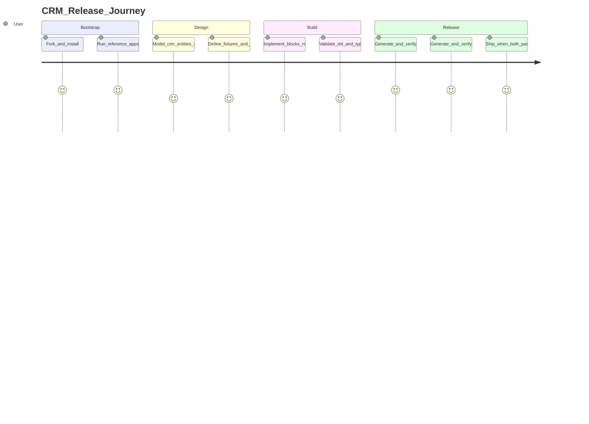
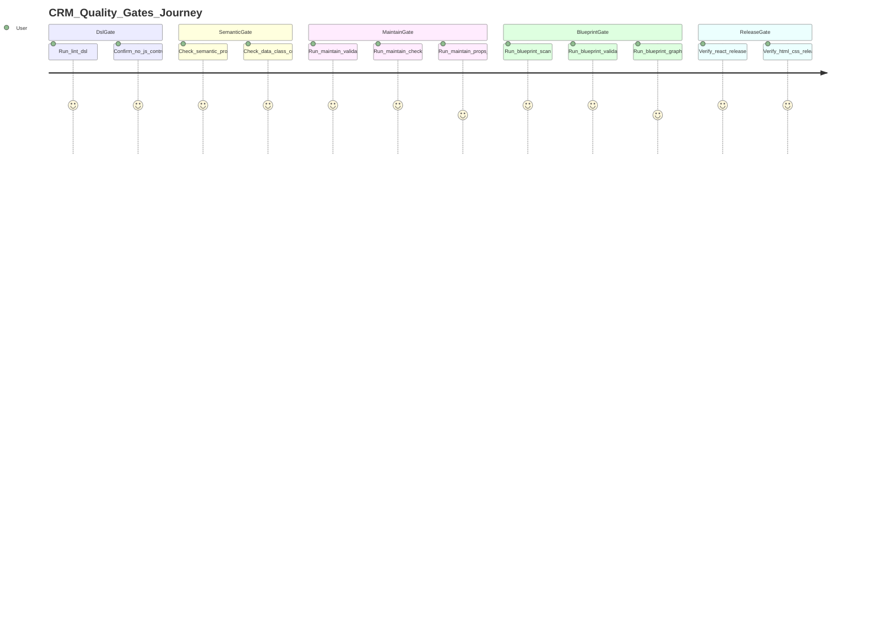
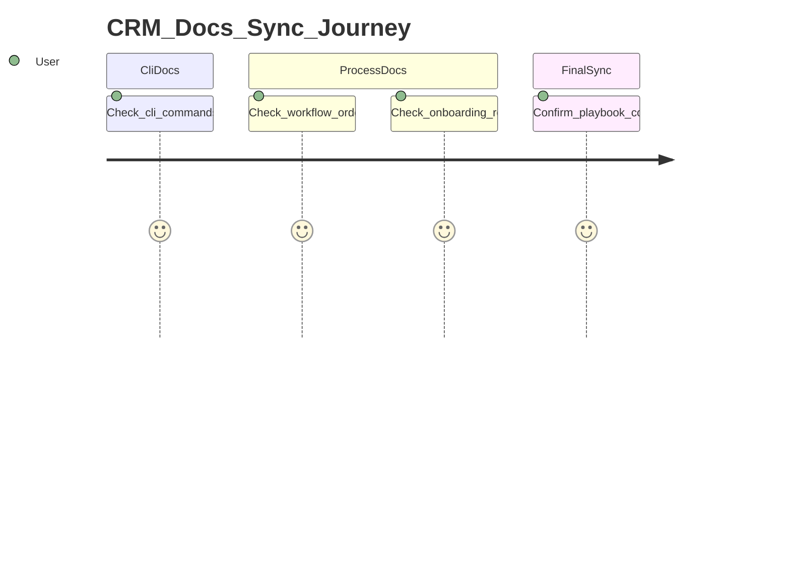

# CRM Visual Playbook

End-to-end onboarding for building `apps/dsl-crm` with full UI8Kit quality coverage and no skipped gates.

Use this together with:

- `ONBOARDING.md` for architecture and DSL rules
- `WORKFLOW.md` for ordered command flow
- `CLI_COMMANDS.md` for CLI command/options details

---

## 1) Release Journey

### Stage checklist

| Stage | Required outputs | Definition of done |
|---|---|---|
| Bootstrap | Local fork builds and both reference apps run | `apps/dsl` and `apps/dsl-design` run with `bun run dev` |
| Design | CRM entities, routes, fixture schema plan | Draft for `fixtures`, `context`, `routes`, `blocks` exists |
| Build | `apps/dsl-crm` skeleton + initial pages/components | DSL rules respected, no hardcode in JSX |
| Release | React and HTML/CSS outputs validated | Both release tracks pass all hard gates |

---

## 2) Quality Gates Journey (All Mandatory)

### Hard-gate command set for `apps/dsl-crm`

Run from `apps/dsl-crm` (create scripts by referencing `apps/dsl` + `apps/dsl-design`):

1. `bun run lint:dsl`
2. `bun run lint:gen` (if your CRM app includes this script/rule set)
3. `bun run validate`
4. `bun run maintain:validate`
5. `bun run maintain:check`
6. `bun run typecheck`
7. `bun run blueprint:scan`
8. `bun run blueprint:validate`
9. `bun run blueprint:graph`
10. If `src/lib/utility-props.map.ts` changed: `bun run build:map` and `bun run maintain:props`
11. `bun run generate`
12. `bun run finalize`
13. Verify generated React app (`../react-crm`) with `bun run typecheck` (inside generated app)
14. Verify HTML/CSS output via generator static pipeline (see `CLI_COMMANDS.md` for `static`, `html`, `render`, `styles`)

If any gate fails, stop and fix before continuing.

---

## 3) Docs Sync Journey (Mandatory)

### Required docs sync checks

- `CLI_COMMANDS.md` matches real CLI help (`bunx maintain --help`, `bunx ui8kit-generate --help`)
- `WORKFLOW.md` still reflects actual gate order and scripts
- `ONBOARDING.md` references this playbook and command sources
- `.project/CRM_PLAYBOOK.md` remains consistent with all three docs

---

## 4) Coverage Matrix (Miss-Nothing Control)

| Stage | Tool | Command/source | Expected result | Pass criteria |
|---|---|---|---|---|
| Bootstrap | Bun/workspace | `bun install`, `bun run dev` | Local app runs | No startup errors |
| Reference | Existing apps | `apps/dsl`, `apps/dsl-design` | Patterns understood | Structure/scripts copied intentionally |
| DSL gate | `@ui8kit/lint` | `bun run lint:dsl` | No DSL violations | No `.map`, `&&`, ternary in JSX |
| Semantic gate | UI8Kit rules | `ONBOARDING.md` + validate output | Semantic props only | No `className`/`style`, `data-class` coverage |
| Validate gate | `@ui8kit/sdk` | `bun run validate` | Config/props/tag checks pass | Exit code 0 |
| Maintain validate | `@ui8kit/maintain` | `bun run maintain:validate` | Core invariants pass | Exit code 0 |
| Maintain full | `@ui8kit/maintain` | `bun run maintain:check` | Enabled checker set passes | Exit code 0 |
| Props map gate | generator+maintain | `bun run build:map`, `bun run maintain:props` | Map and whitelist in sync | No whitelist violations |
| Blueprint gate | `@ui8kit/generator` | `blueprint:scan/validate/graph` | Blueprint updated and valid | Validate passes, graph produced |
| React release | generator | `bun run generate`, `bun run finalize` | `../react-crm` generated | Generated app typecheck passes |
| HTML release | generator | `ui8kit-generate static/html/render/styles` | HTML/CSS artifacts generated | Static output verified |
| Docs sync | project docs | `CLI_COMMANDS.md`, `WORKFLOW.md`, `ONBOARDING.md` | No doc drift | Commands and order match reality |

---

## 5) No-Skip Checklist (Copy/Paste)

- [ ] I used `apps/dsl` and `apps/dsl-design` as implementation references.
- [ ] `apps/dsl-crm` scripts were aligned with real workflow gates.
- [ ] DSL gate passed (`lint:dsl`).
- [ ] Semantic gate passed (no `className`/`style`, `data-class` coverage).
- [ ] Validate gate passed (`validate`).
- [ ] Maintain gates passed (`maintain:validate`, `maintain:check`).
- [ ] Blueprint gates passed (`scan`, `validate`, `graph`).
- [ ] Props map gate passed when utility-props map changed.
- [ ] React release gate passed (`generate`, `finalize`, generated app verification).
- [ ] HTML/CSS release gate passed (static pipeline verified).
- [ ] Docs sync gate passed across `CLI_COMMANDS.md`, `WORKFLOW.md`, `ONBOARDING.md`, and this playbook.

---

## 6) Quick Rescue Paths

| Problem | Immediate action |
|---|---|
| `lint:dsl` fails | Replace JS control-flow with `<If>`, `<Var>`, `<Loop>` patterns from `ONBOARDING.md`. |
| `validate` fails on tags/props | Check semantic props and allowed `component` tags (`component-tag-map`). |
| `maintain:validate` fails | Fix invariants/fixtures/view exports/contracts first, then re-run. |
| `maintain:props` fails | Rebuild map with `build:map`, then resolve whitelist mismatches. |
| `blueprint:validate` fails | Re-run `blueprint:scan`, inspect changes, validate again. |
| React output breaks | Re-run gate chain from validate → maintain → generate/finalize. |
| HTML/CSS output missing | Run static pipeline commands and verify config/routes/fixtures inputs. |
| Docs drift | Refresh CLI help and sync `CLI_COMMANDS.md`, `WORKFLOW.md`, `ONBOARDING.md`. |

---

Last update: 2026-02
