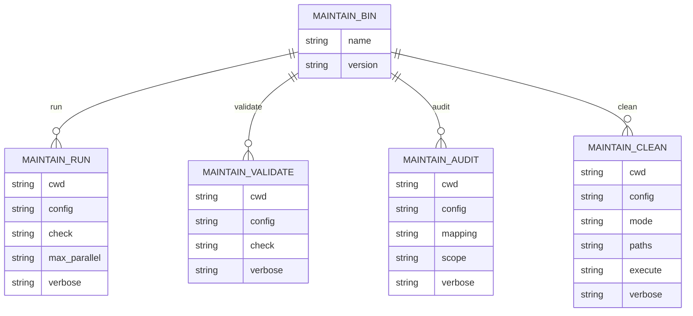
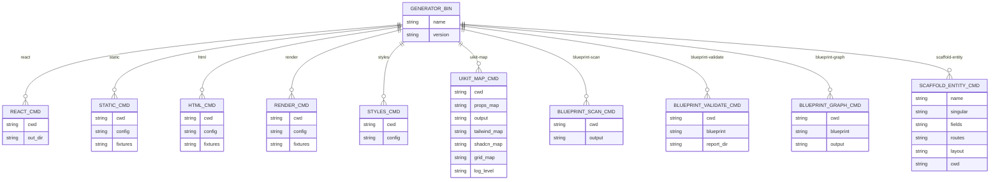

# CLI Commands & Options — Guide Map

Visual reference for CLI commands from `packages/maintain` and `packages/generator`. See WORKFLOW.md and ONBOARDING-101.md for usage.

---

## 1. maintain (@ui8kit/maintain)

| Command       | App script(s)        | Description |
|---------------|----------------------|-------------|
| `maintain run` | `maintain:check`, `maintain:props` | Run checkers from config; `--check` limits to given names. |
| `maintain validate` | `maintain:validate` | Run validation checkers (invariants, fixtures, view-exports, contracts). |
| `maintain audit` | — (or `audit:refactor` via local script in dsl) | Refactor audit checker only. |
| `maintain clean` | `clean`, `clean:dist` | Clean paths from config; `--mode dist` or `full`, `--execute` to apply. |

---

## 2. ui8kit-generate (@ui8kit/generator)

### Commands summary

| Command | Options | App script | Description |
|---------|---------|------------|-------------|
| `react` | `--cwd`, `--out-dir` | `generate` | Build DSL → React (blocks, layouts, partials). |
| `static` (default) | `--cwd`, `--config`, `--fixtures` | — | Full pipeline: Render → CSS → HTML → PostCSS. |
| `html` | `--cwd`, `--config`, `--fixtures` | — | Render + HTML stages. |
| `render` | `--cwd`, `--config`, `--fixtures` | — | Render routes to HTML only. |
| `styles` | `--cwd`, `--config` | — | CSS extraction + PostCSS. |
| `uikit-map` | `--cwd`, `--props-map`, `--output`, `--tailwind-map`, `--shadcn-map`, `--grid-map`, `--log-level` | `build:map` | Generate ui8kit.map.json from utility-props. |
| `blueprint:scan` | `--cwd`, `--output` | `blueprint:scan` | Scan app → blueprint.json. |
| `blueprint:validate` | `--cwd`, `--blueprint`, `--report-dir` | `blueprint:validate` | Validate project vs blueprint. |
| `blueprint:graph` | `--cwd`, `--blueprint`, `--output` | `blueprint:graph` | Build dependency graph. |
| `scaffold entity` | `--name`, `--singular`, `--fields`, `--routes`, `--layout`, `--cwd` | `scaffold:entity` | Scaffold entity with routes, views, fixtures. |

---

## 3. External CLIs (bunx)

These are not in `packages/`; they come from npm (e.g. `@ui8kit/lint`).

| Binary | Typical script | Purpose |
|--------|----------------|---------|
| `ui8kit-validate` | `validate` | Config, DSL, props, component+tag validation. |
| `ui8kit-lint-dsl` | `lint:dsl` | If/Var/Loop usage in src. |
| `ui8kit-lint` | `lint` | General lint. |
| `ui8kit-inspect` | `inspect` | Inspect app/config. |
