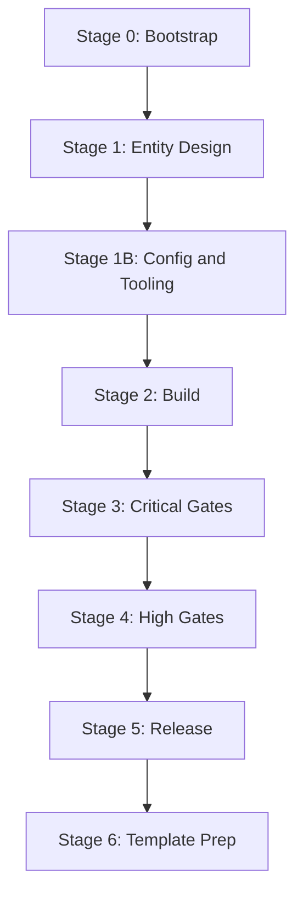
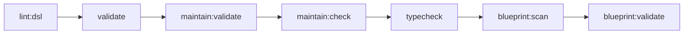

# App Playbook — Universal Template Guide

> **How to use this file:**
> Drop this file into a chat with an AI agent and say _"Check what is not yet done in PLAYBOOK."_
> The agent reads the pipeline, compares it against the project state, and reports what is missing or incomplete.

Use together with:
- `ONBOARDING.md` — architecture and DSL rules
- `WORKFLOW.md` — ordered command flow
- `CLI_COMMANDS.md` — full CLI command/option reference
- `.project/TOOLS_REVIEW.md` — tool significance table

---

## How to Use This as a GitHub Template

This repository is configured as a GitHub template. To create a new app from it:

1. On GitHub, open this repository and click **"Use this template" → "Create a new repository"**.
2. Choose your account, enter a name (e.g. `my-dsl-blog`), and click **"Create repository from template"**.
3. Clone your new repository and run `bun install` from the root.
4. Open `.project/PLAYBOOK.md` (this file) and follow the pipeline from **Stage 0** to **Stage 6**.
5. Pick any existing app (e.g. `apps/dsl`) as your implementation reference.

> See [GitHub Docs — Creating a repository from a template](https://docs.github.com/en/repositories/creating-and-managing-repositories/creating-a-repository-from-a-template) for full details.

Your new app can be anything: `apps/dsl-blog`, `apps/dsl-shop`, `apps/dsl-crm`, etc. The playbook is domain-agnostic.

---

## How to Refactor an Existing App to New Entities

If you already have an app (for example `apps/dsl-crm`) and want to change its domain
(for example from Dashboard/Tasks/Kanban/Reports to Leads/Deals/Clients/Companies):

1. Start at **Stage 1** and redefine your entity map.
2. For every old entity, replace all coupled pieces together:
   fixture JSON, TS type, adapter key, context domain key, PageView block, route, and `App.tsx` route registration.
3. Update all three configs:
   - `maintain.config.json` (required routes + fixture targets + contracts),
   - `blueprint.json` (entities, routes, fixtures),
   - `ui8kit.config.json` (`outDir`, `skipRoutes`, app brand).
4. Run **Stage 3 → Stage 5** gates in order.
5. Log every significant change and gate result in `.project/JOURNAL.md`.

The locked layer (`src/components`, `src/variants`, `src/lib`, `src/assets/css`) stays unchanged during refactoring.

---

## Section 0 — What Stays Locked vs. What You Define

```mermaid
flowchart LR
  subgraph locked [Locked — copy as-is]
    components[src/components/]
    variants[src/variants/]
    lib[src/lib/]
    css[src/assets/css/]
  end
  subgraph domain [Your Domain — define per app]
    fixtures[fixtures/*.json]
    types[src/types/]
    adapters[src/data/adapters/]
    context[src/data/context.ts]
  end
  subgraph ui [Your UI — build per app]
    blocks[src/blocks/]
    routes[src/routes/]
    layouts[src/layouts/]
    partials[src/partials/]
    providers[src/providers/]
  end
  locked --> domain --> ui
```



| Layer | Files | Rule |
|---|---|---|
| **Locked** | `src/components/`, `src/variants/`, `src/lib/`, `src/assets/css/` | Copy verbatim from `apps/dsl`. **Never modify.** |
| **Domain** | `fixtures/*.json`, `src/types/`, `src/data/adapters/`, `src/data/context.ts` | Define once per app. Shape determines all downstream UI. |
| **UI** | `src/blocks/`, `src/routes/`, `src/layouts/`, `src/partials/`, `src/providers/` | Build per app. Follow DSL rules; use locked layer components only. |

---

## Full Pipeline — Status Tracker

> **Agent instruction:** For each stage, check if the listed files exist and the listed commands have been run. Report every item that is missing or has not been verified. Do not skip any stage.



---

### Stage 0 — Bootstrap

**Goal:** Workspace installs and reference apps run.

| Step | Action | Done? |
|---|---|---|
| 0.1 | `bun install` from workspace root — exits 0 | [ ] |
| 0.2 | `bun run dev` in `apps/dsl` — app opens in browser | [ ] |
| 0.3 | New app directory created: `apps/{APP_NAME}/` | [ ] |
| 0.4 | `apps/{APP_NAME}/package.json` with all scripts from reference | [ ] |
| 0.5 | `apps/{APP_NAME}/vite.config.ts`, `tsconfig.json`, `postcss.config.js` in place | [ ] |
| 0.6 | `apps/{APP_NAME}/index.html` in place | [ ] |
| 0.7 | `apps/{APP_NAME}/.env.example` with `VITE_DATA_SOURCE=fixtures` | [ ] |
| 0.8 | `bun run dev` in `apps/{APP_NAME}` — app starts without errors | [ ] |

---

### Stage 1 — Entity Design

**Goal:** Domain fully modelled in fixtures, types, adapter, and context before building UI.

| Step | Action | Done? |
|---|---|---|
| 1.1 | Entities listed — each has: route, fixture file, TS type, PageView name | [ ] |
| 1.2 | `fixtures/shared/site.json` — `{ title, description }` | [ ] |
| 1.3 | `fixtures/shared/navigation.json` — `{ navItems[], sidebarLinks[], adminSidebarLinks[] }` | [ ] |
| 1.4 | `fixtures/shared/page.json` — `{ page: { <domain>: PageEntry[] } }` | [ ] |
| 1.5 | One `fixtures/<entity>.json` per entity (flat, serializable JSON) | [ ] |
| 1.6 | `src/types/<entity>.ts` per entity — types mirror fixture shape exactly | [ ] |
| 1.7 | `src/types/index.ts` exports all types | [ ] |
| 1.8 | `src/data/adapters/types.ts` — `CanonicalContextInput` defined | [ ] |
| 1.9 | `src/data/adapters/fixtures.adapter.ts` — imports all JSON, returns `CanonicalContextInput` | [ ] |
| 1.10 | `src/data/context.ts` — calls adapter, exposes frozen domain objects | [ ] |

**Entity map (fill in for your app):**

| Entity | Route | Fixture | PageView |
|---|---|---|---|
| _(e.g. Home)_ | `/` | `fixtures/home.json` | `HomePageView` |
| Admin Login | `/admin` | (shared) | `AdminLoginPageView` |
| Admin Dashboard | `/admin/dashboard` | `fixtures/admin.json` | `AdminDashboardPageView` |

---

### Stage 1B — Config & Tooling Setup

**Goal:** Config files and scripts are complete before UI implementation and gates.

| Step | Action | Done? |
|---|---|---|
| 1B.1 | `ui8kit.config.json` — `brand` set to app name and `outDir` points to `../react-{APP_NAME}` | [ ] |
| 1B.2 | `maintain.config.json` — `invariants.routes.required` lists all routes | [ ] |
| 1B.3 | `maintain.config.json` — `invariants.fixtures.requiredPageDomains` matches app domains | [ ] |
| 1B.4 | `maintain.config.json` — `fixtures.targets` includes required shared schemas | [ ] |
| 1B.5 | `maintain.config.json` — `contracts.blueprint` points to `blueprint.json` | [ ] |
| 1B.6 | `blueprint.json` seeded with all entities, fixtures, routes, and route files | [ ] |
| 1B.7 | `bun run build:map` executed to generate `src/ui8kit.map.json` | [ ] |
| 1B.8 | `scripts/finalize-dist.ts` exists and resolves output from `ui8kit.config.json` `outDir` | [ ] |
| 1B.9 | All canonical scripts below exist in `package.json` | [ ] |

**Canonical script set (required):**

| Script | Command |
|---|---|
| `dev` | `vite` |
| `build` | `vite build` |
| `generate` | `bunx ui8kit-generate react --cwd .` |
| `finalize` | `bun run scripts/finalize-dist.ts` |
| `dist:app` | full gate chain (lint/validate/maintain/blueprint/generate/finalize/typecheck) |
| `clean` | `maintain clean --config maintain.config.json --mode full --execute` |
| `clean:dist` | `maintain clean --config maintain.config.json --mode dist --execute` |
| `validate` | `bunx ui8kit-validate` |
| `maintain` | alias to `bun run maintain:check` |
| `maintain:check` | `maintain run --config maintain.config.json` |
| `maintain:validate` | `maintain validate --config maintain.config.json` |
| `maintain:props` | `maintain run --config maintain.config.json --check utility-props-whitelist --verbose` |
| `blueprint:scan` | `bunx ui8kit-generate blueprint:scan --cwd .` |
| `blueprint:validate` | `bunx ui8kit-generate blueprint:validate --cwd .` |
| `blueprint:graph` | `bunx ui8kit-generate blueprint:graph --cwd .` |
| `scaffold:entity` | `bunx ui8kit-generate scaffold entity --cwd .` |
| `inspect` | `bunx ui8kit-inspect` |
| `lint:dsl` | `bunx ui8kit-lint-dsl "$PWD/src"` |
| `lint` | `bunx ui8kit-lint` |
| `typecheck` | `bunx tsc --noEmit` |
| `typecheck:react` | `cd ../react-{APP_NAME} && bun run typecheck` |
| `build:map` | `bunx ui8kit-generate uikit-map --cwd .` |

---

### Stage 2 — Build

**Goal:** Locked layer copied, all blocks/routes/layouts implemented with DSL rules.

| Step | Action | Done? |
|---|---|---|
| 2.1 | `src/components/` copied verbatim from `apps/dsl` — not modified | [ ] |
| 2.2 | `src/variants/` copied verbatim from `apps/dsl` — not modified | [ ] |
| 2.3 | `src/lib/` copied verbatim from `apps/dsl` — not modified | [ ] |
| 2.4 | `src/assets/css/` copied verbatim from `apps/dsl` — not modified | [ ] |
| 2.5 | `src/providers/AdminAuthContext.tsx` — auth provider in place | [ ] |
| 2.6 | `src/providers/theme.tsx` — theme provider in place | [ ] |
| 2.7 | `src/layouts/MainLayout.tsx` and `AdminLayout.tsx` implemented | [ ] |
| 2.8 | `src/partials/` — Header, Footer, Sidebar, SidebarContent in place | [ ] |
| 2.9 | `src/blocks/<domain>/<Entity>PageView.tsx` created per entity | [ ] |
| 2.10 | All `<Var>` wrapped in `<If>` — no unwrapped `<Var>` in JSX | [ ] |
| 2.11 | No `.map()`, `&&`, ternary in JSX — use `<If>`, `<Loop>`, `<Var>` only | [ ] |
| 2.12 | No `className`, `style={}` — semantic props and `data-class` only | [ ] |
| 2.13 | `src/blocks/index.ts` exports all blocks | [ ] |
| 2.14 | `src/routes/<domain>/<Entity>Page.tsx` created per entity | [ ] |
| 2.15 | `src/App.tsx` — all routes registered | [ ] |
| 2.16 | `src/main.tsx` — providers wrapped correctly | [ ] |

---

### Stage 3 — Critical Gates

**Goal:** All critical quality checks pass. These are mandatory and block release.



| # | Gate | Command | Significance | Done? |
|---|---|---|---|---|
| 3.1 | DSL lint | `bun run lint:dsl` | Critical | [ ] |
| 3.2 | Semantic validate | `bun run validate` | Critical | [ ] |
| 3.3 | Maintain validate | `bun run maintain:validate` | Critical | [ ] |
| 3.4 | Maintain full check | `bun run maintain:check` | Critical | [ ] |
| 3.5 | TypeScript | `bun run typecheck` | Critical | [ ] |
| 3.6 | Blueprint scan | `bun run blueprint:scan` | Critical | [ ] |
| 3.7 | Blueprint validate | `bun run blueprint:validate` | Critical | [ ] |

> Gate 3.3 (`maintain:validate`) checks: invariants, fixtures schemas, `*View` exports, contracts.
> Gate 3.4 (`maintain:check`) checks: data-class conflicts, component-tag rules, color tokens, utility-prop literals, orphan files, block nesting, gen lint rules.
> Run in order. Stop and fix on any failure. Log every error + fix in `JOURNAL.md`.

---

### Stage 4 — High Gates

**Goal:** Props whitelist and secondary pipeline verified.

| # | Gate | Command | Significance | Done? |
|---|---|---|---|---|
| 4.1 | Props map rebuild | `bun run build:map` | High | [ ] |
| 4.2 | Props whitelist check | `bun run maintain:props` | High | [ ] |
| 4.3 | Blueprint graph | `bun run blueprint:graph` | Medium | [ ] |
| 4.4 | General lint | `bun run lint` | Medium | [ ] |

> Run 4.1 + 4.2 whenever `src/lib/utility-props.map.ts` is changed.
> 4.1 regenerates `ui8kit.map.json`; 4.2 verifies all prop values are in the Tailwind/shadcn whitelist.

---

### Stage 5 — Release

**Goal:** React app generated and verified. HTML/CSS pipeline verified.

| # | Step | Command | Done? |
|---|---|---|---|
| 5.1 | Generate React output | `bun run generate` | [ ] |
| 5.2 | Finalize artifacts | `bun run finalize` | [ ] |
| 5.3 | Verify generated React app | `cd ../react-{APP_NAME} && bun run typecheck` | [ ] |
| 5.4 | Generate static HTML | `bunx ui8kit-generate static --cwd .` | [ ] |
| 5.5 | Generate HTML only | `bunx ui8kit-generate html --cwd .` | [ ] |
| 5.6 | Generate styles | `bunx ui8kit-generate styles --cwd .` | [ ] |
| 5.7 | Verify HTML/CSS artifacts exist in output directory | [ ] |

> Steps 5.4–5.7 require `dist.config.json` to be present in the app root.
> If the file is absent, set up the static pipeline first (see `CLI_COMMANDS.md`).

---

### Stage 6 — Template Preparation

**Goal:** Repository is clean, documented, and ready to publish as a GitHub template.

| # | Step | Done? |
|---|---|---|
| 6.1 | `apps/dsl` runs cleanly — it is the primary reference app | [ ] |
| 6.2 | README at repo root explains template purpose and "Use this template" flow | [ ] |
| 6.3 | `.project/PLAYBOOK.md` up to date (this file) | [ ] |
| 6.4 | `ONBOARDING.md` current — no stale commands | [ ] |
| 6.5 | `WORKFLOW.md` current — gate order matches this playbook | [ ] |
| 6.6 | `CLI_COMMANDS.md` matches real `--help` output | [ ] |
| 6.7 | `maintain clean --mode dist --execute` run in every app — no generated artifacts committed | [ ] |
| 6.8 | No hardcoded secrets or credentials in source (auth uses ENV or placeholder only) | [ ] |
| 6.9 | Repository "Template repository" checkbox enabled in GitHub settings | [ ] |
| 6.10 | `JOURNAL.md` trimmed or archived — only canonical entries remain | [ ] |

---

## Section 2 — Entity Design Guide (Reference)

How to model your domain from scratch. Use `apps/dsl` as the canonical implementation reference.

### Step 1 — Choose your entities

List the pages/domains your app needs. Each entity maps to:
- A fixture JSON file (`fixtures/<entity>.json`)
- A TypeScript type file (`src/types/<entity>.ts`)
- A PageView block (`src/blocks/<domain>/<Entity>PageView.tsx`)
- A route component (`src/routes/<domain>/<Entity>Page.tsx`)
- A route in `src/App.tsx`

### Step 2 — Fixture JSON shape

Keep fixtures flat and serializable. Every fixture is consumed by the adapter and must match the declared TS type.

```json
{
  "title": "Page title",
  "subtitle": "Optional subtitle",
  "items": [
    { "id": "1", "title": "Item title", "description": "..." }
  ]
}
```

Shared fixtures always required:
- `fixtures/shared/site.json` — `{ title, description }`
- `fixtures/shared/navigation.json` — `{ navItems[], sidebarLinks[], adminSidebarLinks[], labels }`
- `fixtures/shared/page.json` — `{ page: { <domain>: PageEntry[] } }`

### Step 3 — TypeScript types

Mirror fixture shape exactly. One file per entity domain. Export all from `src/types/index.ts`.

### Step 4 — Canonical adapter type

`src/data/adapters/types.ts` defines `CanonicalContextInput` — the single shape all adapters must return.

```typescript
export type CanonicalContextInput = {
  site: SiteInfo;
  page: PageFixture['page'];
  navigation: NavigationFixture;
  fixtures: {
    // one key per entity
    home: HomeFixture;
    admin: AdminFixture;
  };
};
```

### Step 5 — Fixtures adapter

`src/data/adapters/fixtures.adapter.ts` imports all JSON and returns `CanonicalContextInput`.

### Step 6 — Context

`src/data/context.ts` calls the adapter and exposes frozen domain objects consumed by routes.

### Step 7 — Blocks and routes

1. `src/blocks/<domain>/<Entity>PageView.tsx` — typed props, DSL components only
2. `src/routes/<domain>/<Entity>Page.tsx` — reads from `context.domains.<domain>`
3. Register in `src/App.tsx`
4. Export from `src/blocks/index.ts`

---

## Section 3 — JOURNAL.md Format

Append one entry per significant event. The agent appends automatically during implementation.

```md
## YYYY-MM-DD — <Stage>: <Title>

**What happened:** Brief description of what was done or attempted.
**Obstacle / Error:** Error message or blocker (write "none" if clean).
**Resolution:** How the obstacle was resolved.
**Gap / LLM pause:** Any knowledge gap encountered (write "none" if clear).
```

Log on: stage start/end, any gate failure + fix, structural decisions, LLM uncertainty, gate pass confirmations.

---

## Section 4 — Quick Rescue Paths

| Problem | Immediate action |
|---|---|
| `lint:dsl` fails | Replace JS control-flow with `<If>`, `<Var>`, `<Loop>`; wrap every `<Var>` in `<If>` |
| `validate` fails on props/tags | Check semantic props; verify allowed `component` values in architecture rules |
| `maintain:validate` fails on missing checkers | Add `fixtures.targets` and `contracts` block to `maintain.config.json`, then re-run |
| `maintain:validate` fails (generic) | Fix invariants/fixtures/view-exports/contracts first, then re-run |
| `maintain:check` fails | Read checker output; fix data-class conflicts, component-tag issues, orphan files |
| `maintain:props` fails | Run `build:map` first, then resolve whitelist mismatches |
| `typecheck` fails | Fix TS errors; check import paths, missing exports, prop type mismatches |
| `blueprint:validate` reports `ORPHAN_FIXTURE` | Add missing fixture entry to `blueprint.json` `entities[].fixture` with correct domain mapping |
| `blueprint:validate` fails (generic) | Re-run `blueprint:scan`, inspect diff, validate again |
| Script not found during gate run | Cross-check Stage 1B canonical scripts table and add the missing script to `package.json` |
| `generate` fails | Ensure validate + maintain gates all pass first |
| `finalize` writes to wrong directory | Verify `ui8kit.config.json` `outDir`; `finalize-dist.ts` must read `outDir` dynamically |
| Generated app misses `@ui8kit/dsl` or `@ui8kit/sdk` | Scan generated `src/` imports and keep required dependencies during finalize |
| Generated app typecheck fails | Re-run gate chain: validate → maintain → generate → finalize |
| Generated app missing constants/types after transform | Move variant mapping constants (for example `PRIORITY_VARIANT`) to `src/types/` or `src/constants/` |
| HTML/CSS output missing | Set up `dist.config.json`; run static pipeline commands |
| Docs drift | Run `--help` on changed CLIs; sync `CLI_COMMANDS.md`, `WORKFLOW.md`, `ONBOARDING.md` |

---

Last update: 2026-03-02
