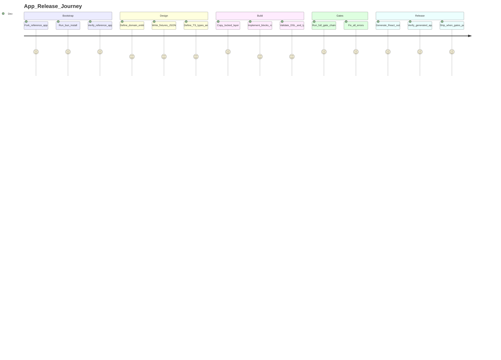

# App Playbook — Universal Template Guide

End-to-end onboarding for building any app with UI8Kit, with full quality gate coverage and no skipped steps.

Use this together with:

- `ONBOARDING.md` — architecture and DSL rules
- `WORKFLOW.md` — ordered command flow
- `CLI_COMMANDS.md` — CLI command/option details

**Live example:** `apps/dsl-crm` (CRM — Dashboard / Tasks / Kanban / Reports + Admin auth)

---

## Section 0 — What Stays Locked vs. What You Define

```mermaid
flowchart LR
  subgraph locked [Locked — copy as-is]
    components[src/components/]
    variants[src/variants/]
    lib[src/lib/]
    css[src/assets/css/]
  end
  subgraph domain [Your Domain — define per app]
    fixtures[fixtures/*.json]
    types[src/types/]
    adapters[src/data/adapters/]
    context[src/data/context.ts]
  end
  subgraph ui [Your UI — build per app]
    blocks[src/blocks/]
    routes[src/routes/]
    layouts[src/layouts/]
    partials[src/partials/]
    providers[src/providers/]
  end
  locked --> domain --> ui
```



| Layer | Files | Rule |
|---|---|---|
| **Locked** | `src/components/`, `src/variants/`, `src/lib/`, `src/assets/css/` | Copy verbatim from `apps/dsl`. **Never modify.** |
| **Domain** | `fixtures/*.json`, `src/types/`, `src/data/adapters/`, `src/data/context.ts` | Define once per app. Shape determines all downstream UI. |
| **UI** | `src/blocks/`, `src/routes/`, `src/layouts/`, `src/partials/`, `src/providers/` | Build per app. Follow DSL rules, use locked layer components. |

---

## Section 1 — Quick Start Journey



### Stage checklist

| Stage | Required outputs | Definition of done |
|---|---|---|
| Bootstrap | Local install succeeds | `bun install` exits 0; reference apps (`apps/dsl`, `apps/dsl-design`) run with `bun run dev` |
| Design | Entity plan written | `fixtures/*.json` schema drafted; `src/types/` defined; adapter wired |
| Build | App skeleton built | Blocks render, routes registered, DSL rules respected, no hardcode in JSX |
| Gates | All gate commands pass | Exit code 0 for every gate in order |
| Release | Generated output verified | React app typecheck passes; HTML/CSS artifacts generated |

---

## Section 2 — Entity Design Guide

How to define your domain and wire it to the UI layer. The CRM app (`apps/dsl-crm`) is used as a worked example throughout.

### Step 1 — Choose your entities

List the pages/domains your app needs. Each entity maps to:
- A fixture JSON file
- A set of TypeScript types
- A PageView block
- A route in `App.tsx`

**CRM example entities:**
| Entity | Route | Fixture | PageView |
|---|---|---|---|
| Dashboard | `/` | `fixtures/dashboard.json` | `DashboardPageView` |
| Tasks | `/tasks` | `fixtures/tasks.json` | `TasksPageView` |
| Kanban | `/kanban` | `fixtures/kanban.json` | `KanbanPageView` |
| Reports | `/reports` | `fixtures/reports.json` | `ReportsPageView` |
| Admin Login | `/admin` | (shared) | `AdminLoginPageView` |
| Admin Dashboard | `/admin/dashboard` | `fixtures/admin.json` | `AdminDashboardPageView` |

### Step 2 — Write fixture JSON

Each fixture file is plain JSON consumed by the adapter. Keep it flat and serializable.

```json
// fixtures/dashboard.json (CRM example)
{
  "title": "CRM Dashboard",
  "subtitle": "Overview of your pipeline",
  "metrics": [
    { "id": "leads", "label": "Total Leads", "value": "142", "trend": "+12%" },
    { "id": "deals", "label": "Open Deals", "value": "38", "trend": "+5%" }
  ]
}
```

Shared fixtures always required:
- `fixtures/shared/site.json` — `{ title, subtitle, description }`
- `fixtures/shared/navigation.json` — `{ navItems[], sidebarLinks[], adminSidebarLinks[], labels }`
- `fixtures/shared/page.json` — `{ page: { <domain>: PageEntry[] } }`

### Step 3 — Define TypeScript types

Create `src/types/` files mirroring the fixture shape. One file per entity domain.

```typescript
// src/types/tasks.ts (CRM example)
export type TaskPriority = 'low' | 'medium' | 'high';
export type TaskStatus = 'todo' | 'in-progress' | 'done';

export type Task = {
  id: string;
  title: string;
  status: TaskStatus;
  priority: TaskPriority;
  assignee?: string;
  dueDate?: string;
};

export type TasksFixture = {
  title: string;
  subtitle: string;
  items: Task[];
};
```

Export everything from `src/types/index.ts`.

### Step 4 — Define the canonical adapter type

In `src/data/adapters/types.ts`, define `CanonicalContextInput` — the shape that all adapters must return:

```typescript
export type CanonicalContextInput = {
  site: SiteInfo;
  page: PageFixture['page'];
  navigation: NavigationFixture;
  fixtures: {
    dashboard: DashboardFixture;
    tasks: TasksFixture;
    kanban: KanbanFixture;
    reports: ReportsFixture;
    admin: AdminFixture;
  };
};
```

### Step 5 — Implement the fixtures adapter

`src/data/adapters/fixtures.adapter.ts` imports all JSON and returns `CanonicalContextInput`:

```typescript
export function loadFixturesContextInput(): CanonicalContextInput {
  return {
    site: siteData as SiteInfo,
    page: (pageData as PageFixture).page,
    navigation: navigationData as CanonicalContextInput['navigation'],
    fixtures: {
      dashboard: dashboardData as DashboardFixture,
      tasks: tasksData as TasksFixture,
      // ...
    },
  };
}
```

### Step 6 — Wire the context

`src/data/context.ts` calls the adapter and exposes frozen domain objects:

```typescript
const crmDomain = Object.freeze({
  page: page.crm ?? [],
  dashboard: baseContext.fixtures.dashboard,
  tasks: baseContext.fixtures.tasks,
  // ...
});

export const context = Object.freeze({
  ...baseContext,
  domains: Object.freeze({ crm: crmDomain, admin: adminDomain }),
});
```

### Step 7 — Build blocks and routes

Follow the pattern from `apps/dsl`:
1. Create `src/blocks/<domain>/<Entity>PageView.tsx` — accepts typed props, uses `<Var>`, `<If>`, `<Loop>`
2. Create `src/routes/<domain>/<Entity>Page.tsx` — reads from `context.domains.<domain>`, renders the PageView
3. Register the route in `src/App.tsx`
4. Export the block from `src/blocks/index.ts`

---

## Section 3 — Quality Gates (Mandatory, All Apps)

Run from the app directory. All gates must pass before release.

| # | Gate | Command | Pass criteria |
|---|---|---|---|
| 1 | DSL lint | `bun run lint:dsl` | No `.map`, `&&`, ternary in JSX; use `<If>`, `<Loop>`, `<Var>` |
| 2 | Semantic validate | `bun run validate` | No `className`/`style`; `data-class` coverage; allowed prop values |
| 3 | Maintain validate | `bun run maintain:validate` | Invariants, fixtures, view exports, contracts pass |
| 4 | Maintain check | `bun run maintain:check` | All enabled checkers pass |
| 5 | TypeScript | `bun run typecheck` | `tsc --noEmit` exits 0 |
| 6 | Blueprint scan | `bun run blueprint:scan` | Blueprint updated |
| 7 | Blueprint validate | `bun run blueprint:validate` | Blueprint is consistent |
| 8 | Generate | `bun run generate` | React output generated |
| 9 | Finalize | `bun run finalize` | Generated app assembled |
| 10 | Verify generated | `cd ../react-crm && bun run typecheck` | Generated app passes TS |

If any gate fails, **stop and fix before continuing**. Log every error and fix in `JOURNAL.md`.

### Quick rescue paths

| Problem | Immediate action |
|---|---|
| `lint:dsl` fails | Replace JS control-flow with `<If>`, `<Var>`, `<Loop>` from `@ui8kit/dsl` |
| `validate` fails on tags/props | Check semantic props; verify allowed `component` values in architecture rules |
| `maintain:validate` fails | Fix invariants/fixtures/view-exports/contracts first |
| `typecheck` fails | Fix TS errors; check import paths and prop types |
| `blueprint:validate` fails | Re-run `blueprint:scan`, inspect changes, validate again |
| Generated app breaks | Re-run gate chain from `validate` → `maintain` → `generate/finalize` |

---

## Section 4 — JOURNAL.md Format

Append one entry per significant event. The agent appends automatically during implementation.

### Entry template

```md
## YYYY-MM-DD — <Stage>: <Title>

**What happened:** Brief description of what was done or attempted.

**Obstacle / Error:** Error message or blocker encountered (if any). Write "none" if clean.

**Resolution:** How the obstacle was resolved or worked around.

**Gap / LLM pause:** Any knowledge gap encountered (e.g. "unsure how X works"). Write "none" if clear.
```

### When to log

- Stage start and end (Bootstrap, Design, Build, Gates, Release)
- Any gate failure + fix (copy the error and the resolution)
- Any structural decision (e.g. "chose 3-column Grid for Kanban")
- Any LLM knowledge gap or uncertainty
- Gate pass confirmations (with command and exit code)

---

## Section 5 — Coverage Matrix

| Stage | Tool | Command | Expected result | Pass criteria |
|---|---|---|---|---|
| Bootstrap | Bun | `bun install` | Dependencies resolved | No install errors |
| Reference | Existing apps | `bun run dev` in `apps/dsl` | App runs | No startup errors |
| DSL gate | `@ui8kit/lint` | `bun run lint:dsl` | No DSL violations | Exit code 0 |
| Semantic gate | `@ui8kit/sdk` | `bun run validate` | Config/props/tag checks pass | Exit code 0 |
| Maintain validate | `@ui8kit/maintain` | `bun run maintain:validate` | Core invariants pass | Exit code 0 |
| Maintain full | `@ui8kit/maintain` | `bun run maintain:check` | All enabled checkers pass | Exit code 0 |
| TypeScript | TypeScript | `bun run typecheck` | No type errors | Exit code 0 |
| Blueprint gate | generator | `blueprint:scan/validate` | Blueprint valid | Exit code 0 |
| React release | generator | `bun run generate && bun run finalize` | `../react-{app}` generated | Generated app typecheck passes |
| Docs sync | project docs | Manual review | No doc drift | Commands match reality |

---

## Section 6 — No-Skip Checklist

Replace `{APP_NAME}` with your app name (e.g. `dsl-crm`).

- [ ] Locked layer copied verbatim from `apps/dsl` — not modified.
- [ ] `apps/{APP_NAME}` scripts aligned with gate workflow.
- [ ] DSL gate passed (`lint:dsl`).
- [ ] Semantic gate passed (`validate`).
- [ ] Maintain gates passed (`maintain:validate`, `maintain:check`).
- [ ] TypeScript gate passed (`typecheck`).
- [ ] Blueprint gates passed (`blueprint:scan`, `blueprint:validate`).
- [ ] React release gate passed (`generate`, `finalize`, generated app verification).
- [ ] All gate results logged in `JOURNAL.md`.

---

## Section 7 — Quick Rescue Paths

| Problem | Immediate action |
|---|---|
| `lint:dsl` fails | Replace JS control-flow with `<If>`, `<Var>`, `<Loop>` from `ONBOARDING.md` patterns |
| `validate` fails on tags/props | Check semantic props and allowed `component` tags in architecture rules |
| `maintain:validate` fails | Fix invariants/fixtures/view exports/contracts first, then re-run |
| `typecheck` fails | Check import paths, prop types, missing exports |
| `blueprint:validate` fails | Re-run `blueprint:scan`, inspect diff, validate again |
| React output breaks | Re-run gate chain from validate → maintain → generate/finalize |
| Docs drift | Refresh CLI help and sync `CLI_COMMANDS.md`, `WORKFLOW.md`, `ONBOARDING.md` |

---

Last update: 2026-03-02
