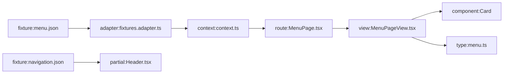
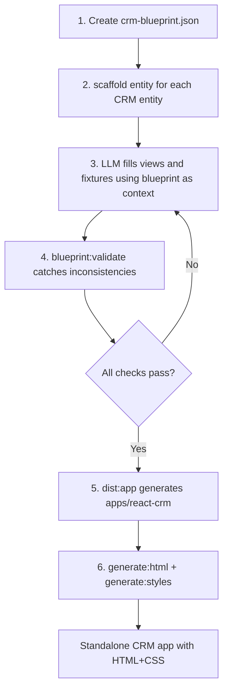

# Blueprint + Rebrand Automation System

## Architecture Overview

```mermaid
flowchart TB
    subgraph tools [CLI Tools]
        scan[blueprint:scan]
        validate[blueprint:validate]
        scaffold[scaffold entity]
        graph[blueprint:graph]
    end

    subgraph artifacts [Generated Artifacts]
        bp[blueprint.json]
        depGraph[dependency-graph.json]
        report[validation-report.md]
    end

    subgraph dsl [apps/dsl]
        config[ui8kit.config.json]
        fixtures[fixtures/*.json]
        types[src/types/*.ts]
        blocks[src/blocks/**/*View.tsx]
        routes[src/routes/**/*.tsx]
        ctx[src/data/context.ts]
        adapters[src/data/adapters/]
        nav[fixtures/shared/navigation.json]
    end

    scan -->|"reads all sources"| bp
    scan -->|"traces imports"| depGraph
    validate -->|"checks against"| bp
    validate -->|"outputs"| report
    scaffold -->|"uses template from"| bp
    scaffold -->|"creates files in"| dsl
    scaffold -->|"updates"| bp

    config --> scan
    fixtures --> scan
    types --> scan
    blocks --> scan
    routes --> scan
    ctx --> scan
    nav --> scan
```


## What Is a Blueprint?

A single `blueprint.json` at the root of each DSL app. It is the **source of truth** for what entities, layouts, domains, and components exist. Example structure:

```json
{
  "$schema": "./schemas/blueprint.schema.json",
  "version": "1",
  "app": { "name": "Resta App", "domain": "restaurant", "lang": "en" },
  "brand": { "primary": "#...", "accent": "#...", "font": "Nunito" },
  "entities": [
    {
      "name": "menu",
      "singular": "MenuItem",
      "fixture": "fixtures/menu.json",
      "fixtureType": "MenuFixture",
      "itemsKey": "items",
      "slugField": "slug",
      "types": "src/types/menu.ts",
      "routes": ["/menu", "/menu/:slug"],
      "views": ["src/blocks/menu/MenuPageView.tsx", "src/blocks/menu/DetailPageView.tsx"],
      "routeFiles": ["src/routes/menu/MenuPage.tsx", "src/routes/menu/DetailPage.tsx"]
    }
  ],
  "layouts": [
    { "name": "MainLayout", "file": "src/layouts/MainLayout.tsx", "view": "src/layouts/views/MainLayoutView.tsx" }
  ],
  "partials": [
    { "name": "Header", "file": "src/partials/Header.tsx" }
  ],
  "components": { "index": "src/components/index.ts", "count": 18 },
  "navigation": { "source": "fixtures/shared/navigation.json", "type": "src/types/navigation.ts" },
  "context": { "file": "src/data/context.ts", "adapter": "src/data/adapters/fixtures.adapter.ts" },
  "domains": ["website", "admin"]
}
```

---

## Phase 1: Blueprint Scanner (`blueprint:scan`)

**File:** `packages/generator/src/scripts/scan-blueprint.ts`

Automatically generates `blueprint.json` by scanning the DSL app:

1. Read `ui8kit.config.json` for paths (`blocksDir`, `layoutsDir`, `partialsDir`, `componentsDir`, `fixtures`)
2. Scan `src/blocks/**/` -- for each subdirectory, detect entity name, views (`*View.tsx` or `*PageView.tsx`), and match to route files in `src/routes/{entity}/`
3. Scan `src/types/` -- map entity name to type file (e.g. `menu` -> `src/types/menu.ts`), extract exported type name for fixture (`MenuFixture`, `MenuItem`, etc.)
4. Scan `fixtures/` -- match JSON files to entities, detect `itemsKey` ("items" vs "posts"), `slugField`
5. Scan `src/data/context.ts` -- extract fixture keys referenced in `createContext()`, extract `dynamicRoutePatterns`
6. Scan `src/data/adapters/types.ts` -- extract `CanonicalContextInput.fixtures` keys and their types
7. Scan `src/layouts/`, `src/partials/` -- list layout and partial files with names
8. Read `fixtures/shared/navigation.json` -- extract nav items and their href values
9. Read `src/App.tsx` -- extract all registered `<Route path="..." />` entries
10. Write `blueprint.json` to app root

**CLI:**

```bash
bunx ui8kit-generate blueprint:scan --cwd apps/dsl
```

**Key source files to parse:**

- [apps/dsl/src/data/adapters/types.ts](apps/dsl/src/data/adapters/types.ts) -- `CanonicalContextInput` defines all entity fixture types
- [apps/dsl/src/data/adapters/fixtures.adapter.ts](apps/dsl/src/data/adapters/fixtures.adapter.ts) -- fixture imports reveal file-to-entity mapping
- [apps/dsl/src/data/context.ts](apps/dsl/src/data/context.ts) -- `createContext<{...}>` shows all fixture keys and `dynamicRoutePatterns`

---

## Phase 2: Dependency Graph (`blueprint:graph`)

**File:** `packages/generator/src/scripts/build-dependency-graph.ts`

Builds `dependency-graph.json` by tracing imports:




For each entity in `blueprint.json`:

1. Start from fixture file
2. Trace through adapter -> context -> route -> view -> components
3. Record edges with types: `fixture -> adapter -> context -> route -> view -> component -> type`
4. Output as JSON adjacency list and optional Mermaid

This already has a partial implementation in [packages/generator/src/scripts/resolve-domain-deps.ts](packages/generator/src/scripts/resolve-domain-deps.ts) which resolves registry items for a domain. Extend this to produce a full graph.

**CLI:**

```bash
bunx ui8kit-generate blueprint:graph --cwd apps/dsl
```

---

## Phase 3: Blueprint Validator (`blueprint:validate`)

**File:** `packages/generator/src/scripts/validate-blueprint.ts`

Extends the existing [apps/dsl/scripts/validate-invariants.ts](apps/dsl/scripts/validate-invariants.ts) with blueprint-aware checks:

**Per-entity checks:**

- Fixture file exists and is valid JSON
- Fixture has the declared `itemsKey` with a non-empty array
- Each item has `slugField` and `id`
- Type file exists and exports `singular` type (e.g., `MenuItem`)
- Fixture type exists in `adapters/types.ts` (e.g., `MenuFixture`)
- `CanonicalContextInput.fixtures` has a key for this entity
- `context.ts` references this entity in `createContext`
- Route files exist for each declared route
- View files exist for each declared view
- Navigation links exist for list routes (e.g., `/menu`)
- `App.tsx` has `<Route>` entries for all declared routes

**Cross-entity checks:**

- No orphan fixtures (fixture exists but no entity in blueprint)
- No orphan routes (route in App.tsx but not in any entity)
- No orphan views (view file in blocks/ but not referenced)
- All domains in blueprint have matching domain objects in `context.ts`

**Output:** Structured report (JSON + markdown) to `.cursor/reports/blueprint-validation.md`

**CLI:**

```bash
bunx ui8kit-generate blueprint:validate --cwd apps/dsl
```

---

## Phase 4: Entity Scaffolder (`scaffold entity`)

**File:** `packages/generator/src/scripts/scaffold-entity.ts`

Creates all files for a new entity:

```bash
bunx ui8kit-generate scaffold entity \
  --name "contacts" \
  --singular "Contact" \
  --fields "name:string,email:string,company:string,phone:string,status:available|archived" \
  --routes "/contacts,/contacts/:slug" \
  --cwd apps/dsl
```

Creates:

- `src/types/contacts.ts` -- TypeScript types derived from `--fields`
- `fixtures/contacts.json` -- empty fixture with correct schema (`{ title, subtitle, items: [] }`)
- `src/blocks/contacts/ContactsPageView.tsx` -- list view (DSL template with Loop/If)
- `src/blocks/contacts/DetailPageView.tsx` -- detail view (DSL template)
- `src/routes/contacts/ContactsPage.tsx` -- route page
- `src/routes/contacts/DetailPage.tsx` -- detail route

Updates:

- `src/data/adapters/types.ts` -- add `ContactsFixture`, `ContactItem` types to `CanonicalContextInput`
- `src/data/adapters/fixtures.adapter.ts` -- add import and mapping
- `src/data/context.ts` -- add to `createContext` fixtures and `dynamicRoutePatterns`
- `fixtures/shared/navigation.json` -- add nav link
- `src/blocks/index.ts` -- add exports
- `src/types/index.ts` -- add export
- `blueprint.json` -- register entity

Templates use the existing component library from [apps/dsl/src/components/index.ts](apps/dsl/src/components/index.ts): `Block`, `Container`, `Stack`, `Card`, `Title`, `Text`, `Badge`, `Image`.

---

## Phase 5: Design-System App (`apps/dsl-design`)

A separate DSL app that documents the design system as live previews. Structure:

```
apps/dsl-design/
  ui8kit.config.json          # outDir: "../react-design"
  blueprint.json              # auto-generated, entities = preview sections
  src/
    blocks/
      tokens/PageView.tsx     # shadcn color swatches, spacing scale
      primitives/PageView.tsx  # all ui8kit components in variations
      widgets/PageView.tsx     # real Card, MenuItem, BlogPost widgets
      typography/PageView.tsx  # font sizes, weights, line-heights
      pages/PageView.tsx       # full-page previews (Hero, MenuPage, etc.)
    layouts/
      DesignLayout.tsx         # minimal doc layout with sidebar nav
    routes/
      tokens/Page.tsx
      primitives/Page.tsx
      widgets/Page.tsx
      typography/Page.tsx
      pages/Page.tsx
    data/
      context.ts               # imports from apps/dsl fixtures (symlink or copy)
  fixtures/
    design.json                # section metadata
```

The same pipeline applies: `bun run generate` -> `bun run finalize` -> `apps/react-design` -> `bun run generate:html` -> static HTML+CSS design docs.

**Workspace additions:**

- Root `package.json` workspaces: add `apps/dsl-design`
- Root `turbo.json`: no changes needed (tasks are inherited)

---

## Phase 6: Rebrand Workflow

With all tools in place, a full rebrand from "restaurant" to "CRM" looks like:




**LLM agent receives:**

- `blueprint.json` -- complete map of all entities, files, types, routes
- `dependency-graph.json` -- how everything connects
- `blueprint:validate` output -- what is broken after each edit
- Component library reference (`src/components/index.ts`)
- Fixture schemas from `adapters/types.ts`

This gives the agent both the **map** and the **compass** -- it knows what exists and can verify after every change.

---

## Implementation Order

Start with the highest-ROI tools that unlock all subsequent automation.