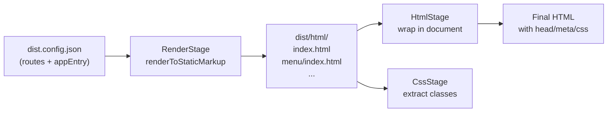

# Turborepo Monorepo + React-to-HTML Generation

## Phase 1: Turborepo Monorepo Setup

### Current structure

```
@ui8kit-resta-app/
  src/                    # DSL source (blocks, layouts, partials with <If>, <Loop>, <Var>)
  dist/react/             # Generated React SPA (Vite app)
  _packages/generator/    # Generator package
  fixtures/               # Data fixtures (menu.json, blog.json, etc.)
  scripts/                # Build scripts
  package.json            # Mixed: DSL deps + generator + react
```

### Target structure

```
@ui8kit-resta-app/
  apps/
    dsl/                  # DSL application (current root src/ + scripts/)
      src/                # blocks, layouts, partials with DSL
      scripts/
      fixtures/
      package.json        # @ui8kit/dsl, @ui8kit/sdk, @ui8kit/lint, etc.
    react/                # Generated React SPA (current dist/react/)
      src/                # Pure React components, routes, data/
      dist/html/          # Generated static HTML output
      dist.config.json
      package.json        # react, react-dom, react-router-dom, @ui8kit/generator
  packages/
    generator/            # Generator (current _packages/generator/)
      package.json        # react as peerDependency (resolved from apps/react)
  turbo.json
  package.json            # Root workspace config (no dependencies, just workspaces)
```

### Key decisions

- **Bun workspaces + Turbo** for orchestration. Root `package.json` declares `workspaces: ["apps/*", "packages/*"]`. Turbo manages task dependency graph.
- **Single `react` instance**: `apps/react` owns `react` + `react-dom`. `packages/generator` declares them as `peerDependencies`. Bun workspace hoisting ensures one copy.
- `**@ui8kit/sdk` must be added** to `apps/react/package.json` as a dependency (currently missing -- `src/data/context.ts` imports from it but it's not declared).
- `**fixtures/`** stays in `apps/dsl/` (source of truth) but can be symlinked or copied to `apps/react/` during the `generate` step.

### Root files

- `package.json`: workspaces only, no deps
- `turbo.json`: pipeline definitions
- `.gitignore`, `tsconfig.json` (base)

### Migration steps

1. Install `turbo` as root devDependency
2. Create root `package.json` with `workspaces: ["apps/*", "packages/*"]`
3. Create root `turbo.json`
4. Move `src/`, `scripts/`, `fixtures/`, DSL-related configs to `apps/dsl/`
5. Move `dist/react/` to `apps/react/`
6. Move `_packages/generator/` to `packages/generator/`
7. Add `@ui8kit/sdk` to `apps/react/package.json` dependencies
8. Add `@ui8kit/generator` as `devDependency` in `apps/react/package.json` using `workspace:*`
9. Update all import paths, tsconfig paths, vite aliases
10. Remove old root `node_modules`, `bun.lock`; run `bun install` from root
11. Verify `bun run dev` works in `apps/react`

### turbo.json tasks

```json
{
  "tasks": {
    "build": { "dependsOn": ["^build"], "outputs": ["dist/**"] },
    "dev": { "cache": false, "persistent": true },
    "generate": { "dependsOn": ["^build"] },
    "generate:html": { "dependsOn": ["generate"] },
    "generate:styles": {},
    "typecheck": { "dependsOn": ["^build"] },
    "lint": {}
  }
}
```

---

## Phase 2: React-to-HTML Generation (`generate:html`)

### Problem being solved

The `html` CLI command currently expects pre-existing HTML files in `outputDir`. There is no stage that renders React components to HTML. We need a new `RenderStage` that uses `renderToStaticMarkup`.

### New stage: `RenderStage`

Location: `packages/generator/src/stages/RenderStage.ts`




The flow becomes:

1. **RenderStage** (new): imports React components from `apps/react/src/`, renders each route via `renderToStaticMarkup`, writes HTML fragments to `dist/html/`
2. **CssStage** (existing): extracts CSS classes from the same components
3. **HtmlStage** (existing): wraps fragments in `<!DOCTYPE>` document with `<head>`, `<meta>`, `<link>` to CSS
4. **PostCssStage** (existing): processes Tailwind/PostCSS

### Config changes

Add `render` section to `dist.config.json`:

```json
{
  "render": {
    "appEntry": "src/App.tsx",
    "providers": ["ThemeProvider", "AdminAuthProvider"],
    "skipRoutes": ["/admin", "/admin/dashboard"]
  }
}
```

- `appEntry` -- path to App.tsx (route definitions are parsed from it)
- `providers` -- optional providers to wrap around rendered components
- `skipRoutes` -- routes to skip during render (e.g. admin pages that need localStorage)

### RenderStage implementation approach

```typescript
// For each route in config:
//   1. Dynamically import the page component
//   2. Wrap in MemoryRouter (for useParams support)
//   3. Optionally wrap in providers (ThemeProvider, etc.) with SSR-safe defaults
//   4. renderToStaticMarkup()
//   5. Write fragment to outputDir/{route}/index.html
```

For detail pages (`/menu/:id`, `/blog/:slug`), fixture data provides the params:

- Route `/menu/grill-salmon-steak` -> `MemoryRouter initialEntries={['/menu/grill-salmon-steak']}`
- The component uses `useParams()` -> returns `{ id: 'grill-salmon-steak' }`
- `context.menu.items.find(i => i.id === id)` resolves the data

### Handling hooks/providers

- `**useParams**`: solved by `MemoryRouter` wrapper
- `**useAdminAuth**`: wrap in `AdminAuthProvider` -> `useState` works in `renderToStaticMarkup` (initial state = `false`) -> `DashboardPage` renders `<Navigate>` (empty output, acceptable) -> or skip via `skipRoutes`
- `**ThemeProvider**`: `getInitialDarkMode()` checks `typeof window === 'undefined'` -> returns `false` -> safe for server render
- `**context` (data)**: plain object, not React context -> works without issues

### Stage registration update

Add `'render'` to `GenerateStageName`:

```typescript
export type GenerateStageName = 'render' | 'css' | 'html' | 'postcss';
```

Update `MODE_STAGES`:

```typescript
const MODE_STAGES = {
  static: ['render', 'css', 'html', 'postcss'],
  html: ['render', 'html'],
  styles: ['css', 'postcss'],
  render: ['render'],
};
```

### Updated dist.config.json for apps/react

```json
{
  "app": { "name": "Resta App", "lang": "en" },
  "render": {
    "appEntry": "src/App.tsx",
    "skipRoutes": ["/admin/dashboard"]
  },
  "css": { "outputDir": "dist/css", "pureCss": true },
  "html": {
    "routes": { "/": { "title": "Home" }, ... },
    "outputDir": "dist/html",
    "mode": "tailwind"
  },
  "postcss": { "enabled": true, ... },
  "mappings": { "ui8kitMap": "src/ui8kit.map.json" },
  "fixtures": { "dir": "fixtures", "collections": ["menu", "recipes", "blog", "promotions"] }
}
```

---

## Phase 3: Verify and Wire Up

- Update `apps/react/package.json` scripts to use generator CLI
- Verify `bun run generate:html` from `apps/react` produces `dist/html/*.html`
- Verify single React instance (no dual-React error)
- Verify `useParams` works via MemoryRouter
- Verify detail pages render with fixture data

